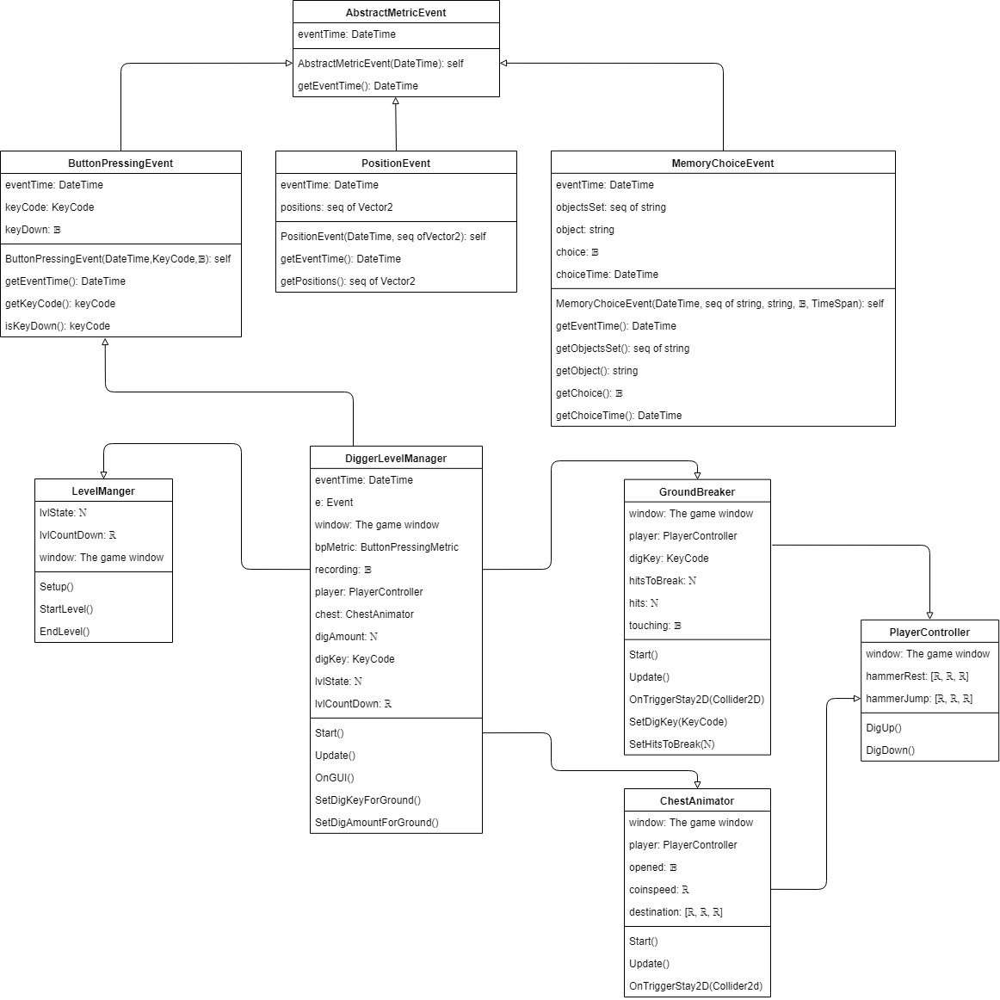

Table of Contents
=================
* [Revision History](#revision-history)
* 1 [Anticipated Changes](#1-anticipated-changes)
* 2 [Unlikely Changes](#2-unlikely-changes)
* 3 [List of Concepts](#3-list-of-concepts)
* 4 [List of Modules](#4-list-of-modules)
  * 4.1 [Battery Module](#41-battery-module)
  * 4.2 [Minigame Modules](#42-minigame-modules)
    * 4.2.0 [Abstract Level Manager Module](#420-abstract-level-manager-module)
    * 4.2.1 [Digger Modules](#421-digger-modules)
      * 4.2.1.1 [Digger Level Manager Module](#4211-digger-level-manager-module)
      * 4.2.1.2 [Digger Player Controller Module](#4212-digger-player-controller-module)
      * 4.2.1.3 [Ground Breaker Module](#4213-ground-breaker-module)
      * 4.2.1.4 [Chest Animator Module](#4214-chest-animator-module)
    * 4.2.2 [Feeder Modules](#422-feeder-modules)
      * 4.2.2.1 [Feeder Level Manager Module](#4221-feeder-level-manager-module)
      * 4.2.2.2 [Food Dispenser Module](#4222-food-dispenser-module)
    * 4.2.3 [Rockstar Modules](#423-thirdgame-modules)
  * 4.3 [Measurement Modules](#43-measurement-modules)
    * 4.3.1 [Abstract Metric Event Module](#431-abstract-metric-event-module)
      * 4.3.1.1 [Button Pressing Event Module](#4311-button-pressing-event-module)
      * 4.3.1.2 [Position Event Module](#4312-position-event-module)
      * 4.3.1.3 [Memory Choice Event Module](#4313-memory-choice-event-module)
      * 4.3.1.4 [Linear Variable Event Module](#4314-linear-variable-event-module)
    * 4.3.2 [Abstract Metric Module](#432-abstract-metric-module)
      * 4.3.2.1 [Button Pressing Metric Module](#4321-button-pressing-metric-module)
      * 4.3.2.2 [Position Metric Module](#4322-position-metric-module)
      * 4.3.2.3 [Memory Choice Metric Module](#4323-memory-choice-metric-module)
      * 4.3.2.4 [Linear Variable Metric Module](#4324-linear-variable-metric-module)
    * 4.3.3 [Metric JSON Writer Module](#433-metric-json-writer-module)
* 5 [List of Changes to SRS](#5-list-of-changes-to-srs)
* 6 [Module Relationship Diagram](#6-module-relationship-diagram)
* 7 [Significant Algorithms/Non-Trivial Invariants](#7-significant-algorithms/non-trivial-invariants)
  * 7.1 [Algorithms](#71-algorithms)
  * 7.2 [Invariants](#72-invariants)
* 8 [Traceability Matrix](#8-traceability-matrix)

# Revision History

# 1. Anticipated Changes

| Number | Name 	             | Rationale | SRS Link                 |
|--------|-----------------------|-----------|--------------------------|
| AC1    | Battery Configuration | Mini-games will contain variables which will allow battery test administers/researchers to make small changes to the game's objectives and functionality. The number of variables from which the researchers can alter for each mini game will change over time as researchers think of new alterations for the games. In order to accommodate these changes each mini game will be passed a variable length dictionary of variables. This allows quicker additions or subtractions of variables and reduces confusion between researchers and mini game developer. | [Requirements](https://github.com/BryanChiu/Mactivision/wiki/Software-Requirements-Specification#3-requirements) |
| AC2    | SRS Document          | The SRS document will continue to evolve throughout the life span of this project. It will be updated with changes discovered during the creation of a design document and for each subsequent major deliverable. | [SRS](https://github.com/BryanChiu/Mactivision/wiki/Software-Requirements-Specification) |
| AC3    | Targeted Abilities    | In the design of the three games listed in this document we have specifically targeted Finger Pressing, Divided Attention, and Updating Working Memory. Which abilities each game measures is subject to change as we create the games and test them with players. The measurement modules will help determine whether a game is accurately and meaningfully capturing the targeted abilities. If the game is not capturing the targeted ability in a significant way, change must be made to the game or to the measurement module. Additionally, it may be discovered that some abilities are irrevocably linked and must be included in the targeted abilities list. Similarly, some games or measurement modules may be ineffective at measuring a specific ability within the scope of the project, in such as case, those abilities may be removed from the targeted list. These changes are expected to occur during the development of the mini games. In anticipation of this, the design the games are kept simple such that they have a minimal number of game elements. Unity allows for these game elements to be modular allowing for easy addition or subtraction from a particular game. Even eliminating an entire game design is a possibility. However, the module nature of the game elements will allow for reuse in any new design created as a replacement. This ensures that development of mini games is agile and can easily adapt to new discoveries in relationships between games and player abilities. | [Work Scope](https://github.com/BryanChiu/Mactivision/wiki/Software-Requirements-Specification#16-work-scope) |
| AC4    | Unity Packages          | The number of Unity packages will increase as development continues during the project. Thankfully, it easy to add and remove packages using the Unity package manager. Graphical and audio assets can also be managed in this way. This makes distributing the assets easier when sharing the unity project between team members and the final deliverable. It also makes it much easier to track which packages we have used over time, as each package and collection of assets have their on page on the unity store. This is particularly important for keeping track of the licenses of these packages to make sure they can be used in the project now and in the future. | [Dependencies](https://github.com/BryanChiu/Mactivision/wiki/Software-Requirements-Specification#25-assumptions-and-dependencies) |
| AC5    | JSON Objects            | JSON is currently used to map data to C# objects and these objects are used to send and store data to and from the battery, mini games and measurement modules. The design and structure of these objects will change as more or less data of differing kinds are need to be shared and transported between modules. These objects are trivial to modify in C# which is why it so valuable that a third party Unity package can convert C# objects to JSON and back. | [Software Interfaces](https://github.com/BryanChiu/Mactivision/wiki/Software-Requirements-Specification#313-software-interfaces) |
| AC6    | Mini-game Length        | Duration of the mini-games will change. Currently, the target length is 30-60 seconds per mini-game, however that time will change depends on the game and what player ability the game is measuring. | [Availability](https://github.com/BryanChiu/Mactivision/wiki/Software-Requirements-Specification#334-availability) |
| AC7   | UI for Battery           | The start screen to get player input and start the battery will change over time to improve user experience. | [User Interfaces](https://github.com/BryanChiu/Mactivision/wiki/Software-Requirements-Specification#311-user-interfaces) |
| AC8   | UI for Mini-games        | Start screen, instructions and end screen will change over time to improve user experience. | [User Interfaces](https://github.com/BryanChiu/Mactivision/wiki/Software-Requirements-Specification#311-user-interfaces) |
| AC9   | UI for Data Manager      | How data is organized and presented will change to improve readbility and findability. | [User Interfaces](https://github.com/BryanChiu/Mactivision/wiki/Software-Requirements-Specification#311-user-interfaces) |
| AC10  | Number of JSON Files     | Currently each games and battery outputs a seperate JSON files. This may be consolidated into one file in future. | [User Interfaces](https://github.com/BryanChiu/Mactivision/wiki/Software-Requirements-Specification#311-user-interfaces) |

# 2. Unlikely Changes

| Number | Name 	                | Rationale | SRS Link                 |
|--------|--------------------------|-----------|--------------------------|
| UC1    | Change Data Format       | JSON data structure is used as input to initialize the battery and as output for measurement data. This may change to another format, for example YAML or XML in future. This change depends on the needs of the researchers administrating the battery. Because the data manager manages convert JSON files into a presentable manner, it unlikely that researchers will want a change in data formats. | [Product Scope](https://github.com/BryanChiu/Mactivision/wiki/Software-Requirements-Specification#12-product-scope) |
| UC2    | Adding Database          | A database may be required to store the data instead of using JSON or other data structures in the long term. However, that is currently outside the scope of this project. | [Work Scope](https://github.com/BryanChiu/Mactivision/wiki/Software-Requirements-Specification#16-work-scope) |
| UC3    | Crash Recovery           | There is currently no plan to include functionality to handle the scenario where the player stops playing the games during the middle of the battery. The administrator of the battery will have to decide if the data collected so far is sufficient or if the battery should be re administered. Similarly, any software crashes or bugs which halt the execution of the battery or any of the mini games will be unrecoverable. The battery module contains no functionality to recover from these errors only to report them to the user and administrator. All attempts will be made to make the software robust enough for this to be unlikely and for error messages to be helpful to players and administrators so they can make actionable decisions. Thankfully, the duration of the battery should be short enough that a battery restart is possible. | [Product Scope](https://github.com/BryanChiu/Mactivision/wiki/Software-Requirements-Specification#12-product-scope) |
| UC4    | Additional Input Devices | Because of COVID-19 most of the players will be completing a battery using a browser and a keyboard. The supervisors of the project hope to be able to add more input types in future, however that will mostly be attempted after Mactivision has submitted their final work. Therefore, it is unlikely that keyboard will change before work is completed. However, since the future of the project will likely add new inputs all efforts have been made, now, to accommodate different input devices. Using Unity to abstract player inputs into actions like "left", "right" and "fire 1" instead of "pad-up", "right arrow", "trigger 2" make accommodating different yet similar input devices trivial. Different kinds of input devices like motion controls and mice can't be mapped as nicely and will require new modules. | [Hardware Interfaces](https://github.com/BryanChiu/Mactivision/wiki/Software-Requirements-Specification#312-hardware-interfaces) |
| UC5    | Adding Music            | While sound effects will be included in mini-games to help with gamification, music which might continue throughout a mini-game will not be included. | [Assumptions](https://github.com/BryanChiu/Mactivision/wiki/Software-Requirements-Specification#25-assumptions-and-dependencies) |

# 3. List of Concepts

This is the table of the list of concepts and definations related to the design:

| Number | Concept       | Definition | Type |  SRS Link |
|--------|---------------|------------|------|-----------|
| C1     | The player    | The user who is told to complete a battery. The player will be using a device to run the battery and a device to send inputs to the battery. For the purpose of this design document we will assume that the player is using a Web Browser and Keyboard respectively. The player is given the battery by the battery administrator. The player runs the battery and is subjected to a series of mini games. The player completes the mini games by using their Keyboard. After the battery is completed the player can stop. | Design Time | [Product Scope](https://github.com/BryanChiu/Mactivision/wiki/Software-Requirements-Specification#12-product-scope). |
| C2     | The administrator | The user who creates the JSON configuration file. This file contains a sequence of mini-games to test the player with and variables which alter various parameters of said mini-games. The player and administrator communicate throughout the battery to makes sure the player starts and completes it correctly. The administrator is also responsible for collected data output from the battery after it has concluded. Gathering completed completed, they will run the data through the data manager to organize and present the data to the researchers. | Design Time | N/A |
| C3     | The researcher | For simplicity, they are separate from administrators, however they will likely assume the same role in practice. Researchers will make decisions based on the information provided by the administrators. These decisions may require altering the JSON configuration file. | Design Time | [Product Scope](https://github.com/BryanChiu/Mactivision/wiki/Software-Requirements-Specification#12-product-scope). |
| C4     | The platform   | Used by players to interact with battery and mini-games. It will be recommended that players run the battery on the newest version of Chrome. To provide a smooth experience to all browser players a target of 60fps should be maintained at all times. Furthermore, the FPS should be capped. Frame rates should remain constant to prevent hardware performance from affecting player performance measurements. | Design Time | [Installation](https://github.com/BryanChiu/Mactivision/wiki/Software-Requirements-Specification#351-installation) |
| C5     | Battery host   | Unity Play allows developers to host their web based Unity game online for users to access. Using this provides quick turn around between making modifications to the project and letting to players and testers to try it out. Additionally, administrators can provide a link to the players and those players can complete the battery online with their web browser and keyboard. | Design Time | [Distribution](https://github.com/BryanChiu/Mactivision/wiki/Software-Requirements-Specification#352-distribution) |
| C6     | Player avatar  |  A collection sprites and animations that make up the player avatar. The player's movements and actions in game will be done through this avatar. The avatar will remain constant between mini games to provide familiarly to the player allowing the player to more easily adjust to the new games. Consistent game elements between games reduces the noise in player performance measurements. | Run Time | [Assumptions](https://github.com/BryanChiu/Mactivision/wiki/Software-Requirements-Specification#25-assumptions-and-dependencies) |
| C7     | Screens        | Each battery and each mini game will contain a start and end screen. The start screen will provide instructions to the player on who to proceed and the end screen will provide notification to the player that the game or battery has ended. | Run Time | [User Interface](https://github.com/BryanChiu/Mactivision/wiki/Software-Requirements-Specification#311-user-interfaces) |
| C8     | Game Objects  | Game Entities are created and destroyed inside the world of the current mini-game. The player interacts with game objects complete the objective of the mini-game. | Run Time | [Functional](https://github.com/BryanChiu/Mactivision/wiki/Software-Requirements-Specification#32-functional) |
| C9     | Unit Testing  | Automated tests created specifically to test whether measurement modules are fit for use. | Design Time | [Verification](https://github.com/BryanChiu/Mactivision/wiki/Software-Requirements-Specification#32-functional) |
| C10    | Modularity  | Breaking up large connected components into seperate smaller components. | Design Time | [Maintainability](https://github.com/BryanChiu/Mactivision/wiki/Software-Requirements-Specification#353-maintainability) |
| C11    | UX Design   | Provide a user experience to the player which invokes in them a feeling that they are playing games and not running tests. | Design Time | [Verification](https://github.com/BryanChiu/Mactivision/wiki/Software-Requirements-Specification#32-functional) |
| C12    | Information Hiding | Seperating design decisions which are most likely to change from the interface implementation. | Design Time | [Maintainability](https://github.com/BryanChiu/Mactivision/wiki/Software-Requirements-Specification#353-maintainability) |

# 4. List of Modules

## 4.1 Battery Module

This section of the document contains all modules relating to the Battery. This module handles the administration of the battery. This includes loading the JSON configuration file, getting player credentials, starting the battery, loading and unloading mini games and ending the battery. 

### Module inherits MonoBehaviour
Battery 

### Uses
`UnityEngine.SceneManagement`,
`Newtonsoft.Json`,
`System.Collections`,
`System.IO`
`System.DateTime`

### Syntax

#### __Exported Constants__
JSON\_BATTERY\_FILENAME

#### __Exported Types__
None

#### __Exported Access Programs__

| Routine Name  | IN     | Out  | Exceptions                |
|---------------|--------|------|---------------------------|
|`LoadBattery`  | string |      | `FileNotFoundException`   | 
|`StartBattery` |        |      |                           | 
|`LoadGame`     | ℕ      | 𝔹    | `SceneCouldNotBeLoaded`   | 
|`UnloadGame`   | ℕ      | 𝔹    | `SceneCouldNotBeUnloaded` | 
|`EndBattery`   |        | JSON | `IOException`             |
|`OnGUI`        |        |      |                           |
|`Start`        |        |      |                           |

### Semantics

#### Environment Variables
window: The game window

#### __State Variables__
`battery`: JSONBattery 
`player_name`: string 
`completed`: 𝔹 
`current_game`: ℕ  
`start_time`: DateTime  
`end_time`: DateTime 

#### __Assumptions__
Battery is also a scene in unity. It is the primary scene and will load and unload other scenes (the games). Because Battery is a scene, Unity will automatically construct the object and then call Start(), therefore Start will act as the constructor. The `battery` variable will need to be available for each game as a global. 

#### __Design Decisions__
Battery was implemented as a scene because of Unity's SceneManager. It allows one scene to control the state (loaded or unloaded) of other scenes.

The `battery` variable is global because each mini game is a scene and scenes do not have constructors from which you can pass variables to.

The Battery module will output a copy of the JSON file used as input with additions of completed status and player name. This allows administrators to change the input file for new batterys will keeping a record of what battery settings were used by that particular player.

#### __Access Routine Semantics__

`LoadBattery(filename)`:
* transition: `battery` := `loadJSON(filename)`
* output: None
* exception: `FileNotFoundException`

`Start()`:
* transition: `completed` := `false`, `current_game` := `0`, `player_name` := `""`
* output: None
* exception: `FileNotFoundException`

`OnGUI()`:
* transition: `window` := Show battery start screen which allows player to input their name and start the battery by hitting a GUI button. `player_name := input`
* output: None
* exception: None

`StartBattery()`:
* transition: `current_game` := `1`, `start_time := DateTime.Now`
* output: None 
* exception: None

`LoadGame(game)`:
* transition: `current\_game` := `game`, `window` := Show loaded scene
* output: None 
* exception: `SceneCouldNotBeLoaded`

`UnloadGame(game)`:
* transition: `current_game` := `0`
* output: None 
* exception: `SceneCouldNotBeUnloaded` 

`EndBattery()`:
* transition: `completed` := `true`, `end_time` := `DateTime.Now`
* output: `JSON` 
* exception: `IOException`

__Local Functions__

`loadScenes(battery)`: ∀ game : battery.games | SceneManager.LoadScene(game, LoadSceneMode.Additive);

`loadJSON(filename)`: JsonConvert.DeserializeObject<JSONBattery>(File.ReadAllText(filename))

`writeJSON(filename)`: File.WriteAllText(filename, JsonConvert.SerializeObject(battery))

## 4.2 Minigame Modules

This section of the document contains all modules relating to the mini-games. These modules are to be implemented in the Unity environment alongside the _Measurement_ modules.

## 4.2.0 Abstract Level Manager Module
abstract `LevelManager` module inherits MonoBehaviour

### Uses
None

### Syntax
#### Exported Constants
None

#### Exported Types
None

#### Exported Access Programs
| Routine Name | In | Out | Exceptions |
|---|---|---|---|
| `Setup` ||||
| `StartLevel` ||||
| `CountDown` ||||
| `EndLevel` ||||

### Semantics
#### Environment Variables
window: The game window

#### State Variables
`lvlState`: `ℕ`

#### State Invariant
`lvlState`∈ {0..3}

#### Assumptions
None

#### Design Decisions
This module provides access routines to inherited modules for pre and post-game features. Specifically it starts the scene with a blurred game scene with an introductory text, then a countdown, and a end game text.

#### Access Routine Semantics
`Setup()`
- transition: `lvlState`:= 0, 
   window := An introductory text is displayed over a blurred game screen

`StartLevel()`
- transition: `lvlState` := 1. `CountDown()`

`CountDown()`
- transition: window := Countdown appears in the middle of the screen and starting at 3. After 0, the countdown is removed and the game screen unblurred. `lvlState` := 2

`EndLevel()`
- transition: `lvlState` := 3.  window := The game screen is blurred and a "level complete" text appears. A button appears to go to the next scene (mini-game or main menu).

## 4.2.1 Digger Modules

This section of modules are used in the Digger game. In this mini-game, the player repeatedly presses a key to dig down towards treasure.

## 4.2.1.1 Digger Level Manager Module
`DiggerLevelManager` module inherits [`LevelManager`](#420-abstract-level-manager-module)

### Uses
[`DiggerPlayerController`](#4212-digger-player-controller-module), [`GroundBreaker`](#4213-ground-breaker-module), [`ChestAnimator`](#4214-chest-animator-module), [`ButtonPressingMetric`](#4321-button-pressing-metric-module), [`ButtonPressingEvent`](#4311-button-pressing-event-module), {UnnamedJSONOutputter}, `UnityEngine.Event`, `UnityEngine.KeyCode`, `System.DateTime`

### Syntax
#### Exported Constants
None

#### Exported Types
None

#### Exported Access Programs
| Routine Name | In | Out | Exceptions |
|---|---|---|---|
| `Start` ||||
| `Update` ||||
| `OnGUI` ||||

### Semantics
#### Environment Variables
`eventTime`: `DateTime`\
`e`: `Event`\
window: The game window

#### State Variables
`bpMetric`: [`ButtonPressingMetric`](#4321-button-pressing-metric-module)\
`recording`: `𝔹`\
`player`: [`DiggerPlayerController`](#4212-digger-player-controller-module)\
`chest`: [`ChestAnimator`](#4214-chest-animator-module)\
`digAmount`: `ℕ`\
`digKey`: `KeyCode`\
`lvlState`: `ℕ` (inherited from [`LevelManager`](#420-abstract-level-manager-module))

#### State Invariant
None

#### Assumptions
`Start` is called at the beginning of the scene.\
`Update` is called once each game cycle.\
`OnGUI` is called when a GUI event occurs (keyboard/mouse); it is called after `Update` in the game cycle.\
`digAmount`>0

#### Design Decisions
This module manages the majority of functionality in the game. The `digAmount` is the number of button presses required to finish the level. It rounds up to the nearest 10 (as there are 10 blocks to break in the level). `digAmount` and `digKey` have default values but can be changed using the battery setup file. 

#### Access Routine Semantics
`Start()`
- transition: `Setup()`(inherited from [`LevelManager`](#420-abstract-level-manager-module)).
   ||:=|
   |---|---|
   |`bpMetric`|new [`ButtonPressingMetric()`](#4321-button-pressing-metric-module)|
   |`recording`|`false`|
   |`digAmount`|100|
   |`digKey`|`KeyCode.B`|
   |window|An introductory text is displayed over a blurred game screen|

`Update()`
- transition: `lvlState`==2 ⇒
   ||⇒|
   |---|---|
   | ¬`recording` | `recording` := `true`. `bpMetric.StartRec()`. `SetDigKeyForGround()`. `SetDigAmountForGround()`|
   | `chest.opened` | `bpMetric.EndRec()`. `EndLevel()`(inherited from [`LevelManager`](#420-abstract-level-manager-module)) |

`OnGUI()`
- transition: `e.isKey` ⇒
   ||⇒|
   |---|---|
   | `lvlState`==0 | `StartLevel()`(inherited from [`LevelManager`](#420-abstract-level-manager-module)) |
   | `lvlState`==2 ∧ `e.keyCode`==`digKey` ∧ press| `bpMetric.AddEvent(new ButtonPressingEvent(DateTime.Now, e.keyCode, true))`. `player.DigDown()` |
   | `lvlState`==2 ∧ `e.keyCode`==`digKey` ∧ release | `bpMetric.AddEvent(new ButtonPressingEvent(DateTime.Now, e.keyCode, false))`. `player.DigUp()` |

#### Local Routine Semantics
`SetDigKeyForGround()`
- transition: ∀ b:[`GroundBreaker`](#4213-ground-breaker-module)| b.`SetDigKey(digKey)`

`SetDigAmountForGround()`
- transition: ∀ b:[`GroundBreaker`](#4213-ground-breaker-module)| b.`SetHitsToBreak( ⌈digAmount/10⌉ )`

## 4.2.1.2 Digger Player Controller Module
`DiggerPlayerController` inherits MonoBehaviour

### Uses
None

### Syntax
#### Exported Constants
None

#### Exported Types
None

#### Exported Access Programs
| Routine Name | In | Out | Exceptions |
|---|---|---|---|
| `DigUp` ||||
| `DigDown` ||||

### Semantics
#### Environment Variables
window: The game window

#### State Variables
`hammerRest`: seq of `ℝ`\
`hammerJump`: seq of `ℝ`

#### State Invariant
None

#### Assumptions
`hammerRest` and `hammerJump` are vectors representing position relative to the player character.

#### Design Decisions
This module controls the digging action of the player.

#### Access Routine Semantics
`DigUp`
- transition: window := The location of the jackhammer is set to `hammerJump`.

`DigDown`
- transition: window := The location of the jackhammer is set to `hammerRest`. A dust sprite is generated in a random position near the jackhammer.

## 4.2.1.3 Ground Breaker Module
`GroundBreaker` inherits MonoBehaviour

### Uses
[`DiggerPlayerController`](#4212-digger-player-controller-module), `UnityEngine.KeyCode`, `UnityEngine.Input`, `UnityEngine.Collider2D`

### Syntax
#### Exported Constants
None

#### Exported Types
None

#### Exported Access Programs
| Routine Name | In | Out | Exceptions |
|---|---|---|---|
| `Start` ||||
| `Update` ||||
| `OnTriggerStay2D` | `Collider2D` |||
| `SetDigKey` | `KeyCode` |||
| `SetHitsToBreak` | `ℕ` |||

### Semantics
#### Environment Variables
window: The game window

#### State Variables
`player`: [`DiggerPlayerController`](#4212-digger-player-controller-module)\
`digKey`: `KeyCode`\
`hitsToBreak`: `ℕ`\
`hits`: `ℕ`\
`touching`: `𝔹`

#### State Invariant
`hits`<`hitsToBreak`

#### Assumptions
`Start` is called at the beginning of the scene\
`Update` is called once each game cycle\
`OnTriggerStay2D` is called when a trigger gameobject is touching another gameobject; it is called before `Update` in the game cycle.

#### Design Decisions
This module controls the breaking of an individual ground block. By default, each block has 10 visual states of breaking and `hitsToBreak` is 10. If `hitsToBreak` is less than 10, then not all visual states will be shown, and if greater than 10, then some/all visual states will take more than one button press to advance.

#### Access Routine Semantics
`Start()`
- transition: `hits`, `touching` := 0, `false`

`Update()`
- transition: `touching` ∧ `Input.GetKeyDown(digKey)` ⇒
   ||⇒|
   |---|---|
   | `hits`<`hitsToBreak`-1 | window := Progress the break animation of this block. |
   | `hits`==`hitsToBreak`-1 | window := Remove this block from the scene. The player falls down to the next block/platform. |

`OnTriggerStay2D(c)`
- transition: `c.gameObject.name`==`player.gameObject.name` ⇒ `touching` := `true`

`SetDigKey(key)`
- transition: `digKey` := `key`

`SetHitsToBreak(hits)`
- transition: `hitsToBreak` := `hits`

## 4.2.1.4 Chest Animator Module
`ChestAnimator` inherits MonoBehaviour

### Uses
[`DiggerPlayerController`](#4212-digger-player-controller-module), `UnityEngine.Collider2D`

### Syntax
#### Exported Constants
None

#### Exported Types
None

#### Exported Access Programs
| Routine Name | In | Out | Exceptions |
|---|---|---|---|
| `Start` ||||
| `Update` ||||
| `OnTriggerStay2D` | `Collider2D` |||

### Semantics
#### Environment Variables
window: The game window

#### State Variables
`player`: [`DiggerPlayerController`](#4212-digger-player-controller-module)\
`opened`: `𝔹`\
`coinspeed`: `ℝ`\
`destination`: seq of `ℝ`

#### State Invariant
None

#### Assumptions
`Start` is called at the beginning of the scene\
`Update` is called once each game cycle\
`OnTriggerStay2D` is called when a trigger gameobject is touching another gameobject; it is called before `Update` in the game cycle.
`destination` are vectors representing position relative to the chest gameobject.

#### Design Decisions
This module controls the chest and coin animation when the player reaches it.

#### Access Routine Semantics
`Start()`
- transition: `hits`, `touching` := 0, `false`

`Update()`
- transition: `opened` ⇒ window := The coin moves toward `destination`.

`OnTriggerStay2D(c)`
- transition: `c.gameObject.name`==`player.gameObject.name` ⇒  `opened` := `true`. window := The chest animates opening.

## 4.2.2 Feeder Modules

This section of modules are used in the Feeder game. In this mini-game, the player has to feed a monster. The foods the monster likes and dislikes change overtime, and the player must remember these changes and correctly feed or discard food being dispensed.

## 4.2.2.1 Feeder Level Manager Module
`FeederLevelManager` module inherits [`LevelManager`](#420-abstract-level-manager-module)

### Uses
[`FoodDispenser`](#4222-food-dispenser-module), [`MemoryChoiceMetric`](#4323-memory-choice-metric-module), [`MemoryChoiceEvent`](#4313-memory-choice-event-module), {UnnamedJSONOutputter}, `UnityEngine.Event`, `UnityEngine.KeyCode`, `System.DateTime`

### Syntax
#### Exported Constants
None

#### Exported Types
None

#### Exported Access Programs
| Routine Name | In | Out | Exceptions |
|---|---|---|---|
| `Start` ||||
| `Update` ||||
| `OnGUI` ||||

### Semantics
#### Environment Variables
`eventTime`: `DateTime`\
`e`: `Event`\
window: The game window

#### State Variables
`mcMetric`: [`MemoryChoiceMetric`](#4323-memory-choice-metric-module)\
`recording`: `𝔹`\
`seed`: `ℕ`\
`totalFoods`: `ℕ`\
`changeFreq`: `ℕ`\
`goodKey`: `KeyCode`\
`badKey`: `KeyCode`\
`maxGameTime`: `ℕ`\
`elapsedGameTime`: `ℝ`\
`dispenser`: [`FoodDispenser`](#4222-food-dispenser-module)\
`currentFood`: `string`
`lvlState`: `ℕ` (inherited from [`LevelManager`](#420-abstract-level-manager-module))\

#### State Invariant
None

#### Assumptions
`Start` is called at the beginning of the scene.\
`Update` is called once each game cycle.\
`OnGUI` is called when a GUI event occurs (keyboard/mouse); it is called after `Update` in the game cycle.\
`totalFoods`>1\
`changeFreq`>0

#### Design Decisions
This module manages the majority of functionality in the game. `totalFoods` is the size of the set of foods available (minimum of two foods). `changeFreq` is the average number of food dispensed between (dis)liked food changes. `totalFoods`, `changeFreq`, `goodKey`, `badKey`, and `maxGameTime` have default values but can be changed using the battery setup file. An optional seed can be provided to run the same sequence of foods.

#### Access Routine Semantics
`Start()`
- transition: `Setup()`(inherited from [`LevelManager`](#420-abstract-level-manager-module)).
   ||:=|
   |---|---|
   |`mcMetric`|new [`MemoryChoiceMetric()`](#4323-memory-choice-metric-module)|
   |`recording`|`false`|
   |`totalFoods`|4|
   |`changeFreq`|3|
   |`goodKey`|`KeyCode.DownArrow`|
   |`badKey`|`KeyCode.UpArrow`|
   |`maxGameTime`|120|
   |`elapsedGameTime`|0|
   |window|An introductory text is displayed over a blurred game screen|
   
   `dispenser.SetDispenser(totalFoods, changeFreq)`. `currentFood` := `dispenser.GetCurrent()`

`Update()`
- transition: `lvlState`==1 ⇒
   |||
   |---|---|
   | ¬`recording` | `recording` := `true`. `mcMetric.StartRec()` |
   | `elaspedGameTime`>`maxGameTime` | `mcMetric.EndRec()`. `EndLevel()`

`OnGUI()`
- transition: `e.isKey` ⇒
   |||
   |---|---|
   | `lvlState`==0 | `StartLevel()`(inherited from [`LevelManager`](#420-abstract-level-manager-module)). `dispense.DispenseNext()` |
   | `lvlState`==1 ∧ `e.keyCode`==`goodKey`| `mcMetric.AddEvent(new MemoryChoiceEvent(dispenser.getChoiceStartTime(), dispenser.MakeChoice(true), dispenser.GetCurrent(), true, DateTime.Now))`. `dispenser.DispenseNext()`|
   | `lvlState`==1 ∧ `e.keyCode`==`badKey`| `mcMetric.AddEvent(new MemoryChoiceEvent(dispenser.getChoiceStartTime(), dispenser.MakeChoice(false), dispenser.GetCurrent(), false, DateTime.Now))`. `dispenser.DispenseNext()`|

## 4.2.2.2 Food Dispenser Module
`FoodDispenser` module inherits Monobehaviour

### Uses
`System.DateTime`, `System.Random`

### Syntax
#### Exported Constants
None

#### Exported Types
None

#### Exported Access Programs
| Routine Name | In | Out | Exceptions |
|---|---|---|---|
| `SetDispenser` |`ℕ`, `ℕ`|||
| `DispenseNext` ||`string`||
| `MakeChoice` |𝔹|seq of `string`||
| `GetCurrent` ||`string`||
| `GetChoiceStartTime` ||`DateTime`||

### Semantics
#### Environment Variables
window: The game window

#### State Variables
`allFoods`: seq of `string`\
`gameFoods`: seq of `string`\
`goodFoods`: seq of `string`\
`changeFreq`: `ℕ`\
`currentFood`: `string`\
`choiceStartTime`: `DateTime`\
`rand`: `Random`

#### State Invariant
`gameFoods` ⊆ `allFoods`\
`goodFoods` ⊆ `gameFoods`\
`currentFood` ∈ `gameFoods`

#### Assumptions
`allFoods` is already set from within Unity\
`SetDispenser` is called in Feeder Level Manager module's `Start()`\
`Update` is called once each game cycle.

#### Design Decisions
This module manages the game's available foods and dispensing of foods. It  `allFoods` are all the food items available in the implementation of the game. `gameFoods` are the food items being used in the current game. `goodFoods` are the current set of food items the monster likes. 

#### Access Routine Semantics
`setDispenser(tf, cf)`
- transition: `gameFoods` ⊆ `allFoods` ∧ |`gameFoods`|==`tf`. `goodFoods` ⊆ `gameFoods`. `currentFood` := `gameFoods[rand.NextInt(|gameFoods|)]`. `changeFreq` := `cf`.

`DispenseNext()`
- transition: `UpdateFoods()`. `currentFood` := `gameFoods[rand.NextInt(|gameFoods|)]`. 
   window := If a change in foods occur, a graphic appears showing this change. The graphic disappears after some time and the next food item is dispensed. 
   `choiceStartTime` := `DateTime.Now`
   
`MakeChoice(choice)`
- transition: window := The food gets pushed into the monster's mouth if `choice` and into the trash if ¬`choice`. Monster reacts according to decision.
- output: *out* := `gameFoods`

`GetCurrent()`
- output: *out* := `currentFood`

`GetChoiceStartTime()`
- output: *out* := `choiceStartTime`

#### Local Routine Semantics
`UpdateFoods()`
- transition: `rand.NextDouble()` < 1/`changeFreq` ⇒ add/remove a food item to/from `gameFoods`

## 4.2.3 Rockstar Modules

This section of modules are used in the ThirdGame game.

## 4.3 Measurement Modules

This section of the document contains all modules relating to the _Measurement Modules_. These modules are to be implemented alongside the _Minigame_ modules in the Unity environment, and will be accessed by modules in the _Minigame_ set of modules.

## 4.3.1 Abstract Metric Event Module
  `abstract AbstractMetricEvent` Module 
  ### Uses
  * `System.DateTime`
  ### Syntax
  #### **Exported Constants**
  None
  #### **Exported Types**
  None
  #### **Exported Access Programs**
  |Routine Name|In |Out |Exceptions |
  |---|---|---|---|
  |`AbstractMetricEvent`|`DateTime`|`AbstractMetricEvent`||
  |`getEventTime`||`DateTime`||

  ### Semantics
  #### **State Variables**
  * `eventTime: DateTime`
  #### **Assumptions**
  * The constructor `AbstractMetricEvent(DateTime)` is called before any other access routines are called for that object.
  #### **Design Decision**
  This module is to represent an abstract class for all _Metric Events_. Every _Metric Event_ at least has a time stamp (`eventTime`) in which the event occurred.
  #### **Access Routine Semantics**
  `AbstractMetricEvent(et)`
  * transition: eventTime = et
  * output: _out_ := _self_
  * exception: none

  `getEventTime()`
  * transition: none
  * output: _out_ := eventTime
  * exception: none
## 4.3.1.1 Button Pressing Event Module
  `ButtonPressingEvent` Module inherits [`AbstractMetricEvent`](#431-abstract-metric-event-module)
  ### Uses
  * [`AbstractMetricEvent`](#431-abstract-metric-event-module)
  * `System.DateTime`
  * `UnityEngine.KeyCode`
  ### Syntax
  #### **Exported Constants**
  None
  #### **Exported Types**
  None
  #### **Exported Access Programs**
  |Routine Name|In |Out |Exceptions |
  |---|---|---|---|
  |`ButtonPressingEvent`|`DateTime`, `KeyCode`, `𝔹`|`ButtonPressingEvent`||
  |`getEventTime`||`DateTime`||
  |`getKeyCode`||`KeyCode`||
  |`isKeyDown`||`𝔹`||

  ### Semantics
  #### **State Variables**
  * `eventTime: DateTime` (inherited from `AbstractMetricEvent`)
  * `keyCode: KeyCode`
  * `keyDown: 𝔹` 
  #### **Assumptions**
  * The constructor `ButtonPressingEvent(DateTime,KeyCode, 𝔹)` is called before any other access routines are called for that object.
  #### **Design Decision**
  This module represents the [`ButtonPressingEvent`](#4311-button-pressing-event-module) class which can be instantiated by a _Minigame_ to store data relating to a single _Button Pressing Metric Event_. This object should be passed to a _Button Pressing Metric_ object ([`ButtonPressingMetric`](#4321-button-pressing-metric-module)) for consumption. Every _Button Pressing Metric Event_ has a time stamp (`eventTime`) in which the event occurred, a key code (`keyCode`) representing the keyboard key which was pressed, and a key value (`keyDown`), representing if the key is pressed down or not (`true` indicated the key is pressed down).
  #### **Access Routine Semantics**
  `ButtonPressingEvent(et, kc, kd)`
  * transition: eventTime, keyCode, keyDown = et, kc, kd
  * output: _out_ := _self_
  * exception: none

  `getEventTime()` (inherited from `AbstractMetricEvent`)
  * transition: none
  * output: _out_ := eventTime
  * exception: none

  `getKeyCode()`
  * transition: none
  * output: _out_ := keyCode
  * exception: none

  `getKeyDown()`
  * transition: none
  * output: _output_ := keyCode
  * exception: none

## 4.3.1.2 Position Event Module
  `PositionEvent` Module inherits [`AbstractMetricEvent`](#431-abstract-metric-event-module)
  ### Uses
  * [`AbstractMetricEvent`](#431-abstract-metric-event-module)
  * `System.DateTime`
  * `UnityEngine.Vector2`
  ### Syntax
  #### **Exported Constants**
  None
  #### **Exported Types**
  None
  #### **Exported Access Programs**
  |Routine Name|In |Out |Exceptions |
  |---|---|---|---|
  |`PositionEvent`|`DateTime`, seq of `Vector2`|`PositionEvent`||
  |`getEventTime`||`DateTime`||
  |`getPositions`||seq of `Vector2`||

  ### Semantics
  #### **State Variables**
  * `eventTime: DateTime` (inherited from `AbstractMetricEvent`)
  * `positions: `seq of `Vector2`
  #### **Assumptions**
  * The constructor `PositionEvent(DateTime,`seq of `Vector2)` is called before any other access routines are called for that object.
  #### **Design Decision**
  This module represents the `PositionEvent` class which can be instantiated by a _Minigame_ to store data relating to a single _Position Metric Event_. This object should be passed to a _Position Metric_ object ([`PositionMetric`](#4322-position-metric-module)) for consumption. Every _Position Metric Event_ has a time stamp (`eventTime`) in which the event occurred, and an array of vector (`Vector2`) objects representing the positions of objects in the game. The names/ids of these objects are stored in the ([`PositionMetric`](#4322-position-metric-module)) which will consume these events.
  #### **Access Routine Semantics**
  `PositionMetric(et, pos)`
  * transition: eventTime, positions = et, pos
  * output: _out_ := _self_
  * exception: none

  `getEventTime()` (inherited from `AbstractMetricEvent`)
  * transition: none
  * output: _out_ := eventTime
  * exception: none

  `getPositions()`
  * transition: none
  * output: _out_ := positions
  * exception: none

## 4.3.1.3 Memory Choice Event Module
  `MemoryChoiceEvent` Module inherits [`AbstractMetricEvent`](#431-abstract-metric-event-module)
  ### Uses
  * [`AbstractMetricEvent`](#431-abstract-metric-event-module)
  * `System.DateTime`
  ### Syntax
  #### **Exported Constants**
  None
  #### **Exported Types**
  None
  #### **Exported Access Programs**
  |Routine Name|In |Out |Exceptions |
  |---|---|---|---|
  |`MemoryChoiceEvent`|`DateTime`, seq of `string`, `string`, `𝔹`, `DateTime`|`MemoryChoiceEvent`||
  |`getEventTime`||`DateTime`||
  |`getObjectsSet`||seq of `string`||
  |`getObject`||`string`||
  |`getChoice`||`𝔹`||
  |`getChoiceTime`||`DateTime`||

  ### Semantics
  #### **State Variables**
  * `eventTime: DateTime` (inherited from `AbstractMetricEvent`)
  * `objectsSet:` seq of `string`
  * `object: string`
  * `choice: 𝔹`
  * `choiceTime: DateTime`
  #### **Assumptions**
  * The constructor `MemoryChoiceEvent(DateTime,`seq of `string, string, 𝔹, DateTime)` is called before any other access routines are called for that object.
  #### **Design Decision**
  This module represents the `MemoryChoiceEvent` class which can be instantiated by a _Minigame_ to store data relating to a single _Memory Choice Event_. This object should be passed to a _Memory Choice Metric_ object ([`MemoryChoiceMetric`](#memory-choice-metric-module)) for consumption. Every _Memory Choice Event_ has a time stamp (`eventTime`) in which the event occurred, and an array of strings (`objectsSet`) representing the set of objects which should be answered `true`: ie., if `object` is a member of `objectsSet`, `choice` should be `true` if the user guesses correctly; `false` if the user guesses incorrectly. `choiceTime` is the timestamp the user made the choice, and `eventTime` is the timestamp the choice was presented to the user. If you subtract the two, the result is the time it took for the user to make the choice.
  #### **Access Routine Semantics**
  `MemoryChoiceEvent(et, os, o, c, ct)`
  * transition: `eventTime`, `objectsSet`, `object`, `choice`, `choiceTime` = `et`, `os`, `o`, `c`, `ct` 
  * output: _out_ := _self_
  * exception: none

  `getEventTime()` (inherited from `AbstractMetricEvent`)
  * transition: none
  * output: _out_ := `eventTime`
  * exception: none

  `getObjectsSet()`
  * transition: none
  * output: _out_ := `objectsSet`
  * exception: none

  `getObject()`
  * transition: none
  * output: _out_ := `object`
  * exception: none

  `getChoice()`
  * transition: none
  * output: _out_ := `choice`
  * exception: none

  `getChoiceTime()`
  * transition: none
  * output: _out_ := `choiceTime`
  * exception: none

## 4.3.1.4 Linear Variable Event Module
`LinearVariableEvent` Module inherits [`AbstractMetricEvent`](#431-abstract-metric-event-module)
  ### Uses
  * [`AbstractMetricEvent`](#431-abstract-metric-event-module)
  * `System.DateTime`
  ### Syntax
  #### **Exported Constants**
  None
  #### **Exported Types**
  None
  #### **Exported Access Programs**
  |Routine Name|In |Out |Exceptions |
  |---|---|---|---|
  |`LinearVariableEvent`|`DateTime`, `ℝ`, `ℝ`, `ℕ`|`LinearVariableEvent`||
  |`getEventTime`||`DateTime`||
  |`getCurrentValue`||`ℝ`||
  |`getValueChange`||`ℝ`||
  |`getReasonIndex`||`ℕ`||

  ### Semantics
  #### **State Variables**
  * `eventTime: DateTime` (inherited from `AbstractMetricEvent`)
  * `currentValue: ℝ`
  * `valueChange: ℝ`
  * `reasonIndex: ℕ`
  #### **Assumptions**
  * The constructor `LinearVariableEvent(DateTime, ℝ, ℝ, ℕ)` is called before any other access routines are called for that object.
  #### **Design Decision**
  This module is for the class `LinearVariableEvent`, which contains the data for each _event_ passed to `LinearVariableMetric#recordEvent()`. This data contains the _event time_, _current value_ (which is the value after the change), _value change_ (change in value since last event), and _index of reason_ (the reason for the change in the event. Index refers to the position in the array of _reasons_ stored in `LinearVariableMetric`).
  #### **Access Routine Semantics**
  `LinearVariableEvent(et, cv, vc, ri)`
  * transition: `eventTime`, `currentValue`, `valueChange`, `reasonIndex` = `et`, `cv`, `vc`, `ri` 
  * output: _out_ := _self_
  * exception: none

  `getEventTime()` (inherited from `AbstractMetricEvent`)
  * transition: none
  * output: _out_ := `eventTime`
  * exception: none

  `getCurrentValue()`
  * transition: none
  * output: _out_ := `currentValue`
  * exception: none

  `getValueChange()`
  * transition: none
  * output: _out_ := `valueChange`
  * exception: none

  `getReasonIndex()`
  * transition: none
  * output: _out_ := `reasonIndex`
  * exception: none

## 4.3.2 Abstract Metric Module
  `abstract AbstractMetric`
  ### Uses
  * [`AbstractMetricEvent`](#431-abstract-metric-event-module)
  * `Newtonsoft.Json`
  ### Syntax
  #### **Exported Constants**
  None
  #### **Exported Types**
  None
  #### **Exported Access Programs**
  |Routine Name|In |Out |Exceptions |
  |---|---|---|---|
  |`AbstractMetric`||`AbstractMetric`||
  |`startRecording`||||
  |`finishRecording`||||
  |`recordEvent`|`AbstractMetricEvent`|||
  |`abstract getJSON`||JSON||
  ### Semantics
  #### **State Variables**
  * `isRecording: 𝔹`
  * `eventList:` seq of `AbstractMetricEvent`
  #### **Assumptions**
  * The constructor `AbstractMetric()` is called before any other access routines are called for that object, and is also called before any other access routines from objects of children classes of `AbstractMetric`.
  #### **Design Decision**
  This module is for the class `AbstractMetric`, which is a parent class of many _metrics_, ie. `ButtonPressingMetric`, `PositionMetric`, etc. This class has a method `recordEvent` which will take some subclass of `AbstractMetricEvent` as input. Each time an event is passed to the metric, it will append it to `eventList`. 
  
  The `abstract` method `getJSON` will also be implemented by all child classes, and will be used to deliver all data recorded by `recordEvent` as JSON to the caller. This will be used by the `MetricWriter` module to output all game data as a JSON file. 

  `startRecording` and `stopRecording` are to toggle a `AbstractMetric` object's `isRecording` state, which will allow for recording of events while `true`, and allow outputting of JSON when it is false.
  #### **Access Routine Semantics**
  `AbstractMetric()`
  * transition: `isRecording`, `eventList` = `false`, `<>`
  * output: _out_ := _self_
  * exception: none

  `startRecording()`
  * transition: `isRecording` = `true`
  * output: none
  * exception: none

  `stopRecording()`
  * transition: `isRecording` = `false`
  * output: none
  * exception: none

  `recordEvent(e)`
  * transition: _if_ (`isRecording`) _then_ `eventList = eventList||<e>` _else_ none
  * output: none
  * exception: none

  `abstract getJSON()`
  * _This method is to be implemented by all children classes_
  
## 4.3.2.1 Button Pressing Metric Module
  `ButtonPressingMetric` extends `AbstractMetric`
  ### Uses
  * [`AbstractMetric`](#432-abstract-metric-module)
  * `ButtonPressingEvent`
  * `Newtonsoft.Json`
  ### Syntax
  #### **Exported Constants**
  None
  #### **Exported Types**
  None
  #### **Exported Access Programs**
  |Routine Name|In |Out |Exceptions |
  |---|---|---|---|
  |`ButtonPressingMetric`||`ButtonPressingMetric`||
  |`startRecording`||||
  |`finishRecording`||||
  |`recordEvent`|`ButtonPressingEvent`|||
  |`getJSON`||JSON||
  ### Semantics
  #### **State Variables**
  * `isRecording: 𝔹` (inherited from `AbstractMetric`)
  * `eventList`: seq of `ButtonPressingEvent` (inherited from `AbstractMetric`)
  #### **Assumptions**
  * The constructor `ButtonPressingMetric()` is called before any other access routines are called for that object. `ButtonPressingMetric()` will invoke the `AbstractMetric()` (inherited from `AbstractMetric`) before any other statements are executed.
  #### **Design Decision**
  This class is a subclass of `AbstractMetric`, and is used to record `ButtonPressingEvent` objects passed from a _Level Manager_. when `getJson()` is invoked, it will return a JSON object containing all the data stored in `eventList`, as well as the name of this _Metric_.
  #### **Access Routine Semantics**
  `ButtonPressingMetric(keys)`
  * transition: `gameObjectKeys` := `keys`
  * output: _out_ := _self_
  * exception: none

  `startRecording()` (inherited from `AbstractMetric`)
  * transition: `isRecording` = `true`
  * output: none
  * exception: none

  `stopRecording()` (inherited from `AbstractMetric`)
  * transition: `isRecording` = `false`
  * output: none
  * exception: none

  `recordEvent(e)` (inherited from `AbstractMetric`)
  * transition: _if_ (`isRecording`) _then_ `eventList = eventList||<e>` _else_ none
  * output: none
  * exception: none

  `getJSON()`
  * transition: none
  * output: _out_ := JSON parsed from `eventList`
  * exception: none
## 4.3.2.2 Position Metric Module
  `PositionMetric` extends `AbstractMetric`
  ### Uses
  * [`AbstractMetric`](#432-abstract-metric-module)
  * `PositionEvent`
  * `Newtonsoft.Json`
  ### Syntax
  #### **Exported Constants**
  None
  #### **Exported Types**
  None
  #### **Exported Access Programs**
  |Routine Name|In |Out |Exceptions |
  |---|---|---|---|
  |`PositionMetric`|seq of `string`|`PositionMetric`||
  |`startRecording`||||
  |`finishRecording`||||
  |`recordEvent`|`PositionEvent`|||
  |`getJSON`||JSON||
  ### Semantics
  #### **State Variables**
  * `isRecording: 𝔹` (inherited from `AbstractMetric`)
  * `eventList`: seq of `PositionEvent` (inherited from `AbstractMetric`)
  * `gameObjectKeys:` seq of `string`
  #### **Assumptions**
  * The constructor `PositionMetric(`seq of `string)` is called before any other access routines are called for that object. `PositionMetric(`seq of `string)` will invoke the `AbstractMetric()` (inherited from `AbstractMetric`) before any other statements are executed.
  #### **Design Decision**
  This class is a subclass of `AbstractMetric`, and is used to record `PositionEvent` objects passed from a _Level Manager_. `PositionEvent` objects records a sequence of labeled _Vectors_ which correspond to positions of game objects in the _minigame_. When `getJson()` is invoked, it will return a JSON object containing all the data stored in `eventList`, as well as the name of this _Metric_, and the names of the objects being recorded.
  #### **Access Routine Semantics**
  `ButtonPressingMetric()`
  * transition: none
  * output: _out_ := _self_
  * exception: none

  `startRecording()` (inherited from `AbstractMetric`)
  * transition: `isRecording` = `true`
  * output: none
  * exception: none

  `stopRecording()` (inherited from `AbstractMetric`)
  * transition: `isRecording` = `false`
  * output: none
  * exception: none

  `recordEvent(e)` (inherited from `AbstractMetric`)
  * transition: _if_ (`isRecording`) _then_ `eventList = eventList||<e>` _else_ none
  * output: none
  * exception: none

  `getJSON()`
  * transition: none
  * output: _out_ := JSON parsed from `eventList`
  * exception: none
## 4.3.2.3 Memory Choice Metric Module
  `MemoryChoiceMetric` extends `AbstractMetric`
  ### Uses
  * [`AbstractMetric`](#432-abstract-metric-module)
  * `PositionEvent`
  * `Newtonsoft.Json`
  ### Syntax
  #### **Exported Constants**
  None
  #### **Exported Types**
  None
  #### **Exported Access Programs**
  |Routine Name|In |Out |Exceptions |
  |---|---|---|---|
  |`MemoryChoiceMetric`||`MemoryChoiceMetric`||
  |`startRecording`||||
  |`finishRecording`||||
  |`recordEvent`|`MemoryChoiceEvent`|||
  |`getJSON`||JSON||
  ### Semantics
  #### **State Variables**
  * `isRecording: 𝔹` (inherited from `AbstractMetric`)
  * `eventList`: seq of `MemoryChoiceEvent` (inherited from `AbstractMetric`)
  #### **Assumptions**
  * The constructor `MemoryChoiceMetric()` is called before any other access routines are called for that object. `MemoryChoiceMetric()` will invoke the `AbstractMetric()` (inherited from `AbstractMetric`) before any other statements are executed.
  #### **Design Decision**
  This class is a subclass of `AbstractMetric`, and is used to record `PositionEvent` objects passed from a _Level Manager_. `PositionEvent` objects records a sequence of labeled _Vectors_ which correspond to positions of game objects in the _minigame_. When `getJson()` is invoked, it will return a JSON object containing all the data stored in `eventList`, as well as the name of this _Metric_, and the names of the objects being recorded.
  #### **Access Routine Semantics**
  `ButtonPressingMetric()`
  * transition: none
  * output: _out_ := _self_
  * exception: none

  `startRecording()` (inherited from `AbstractMetric`)
  * transition: `isRecording` = `true`
  * output: none
  * exception: none

  `stopRecording()` (inherited from `AbstractMetric`)
  * transition: `isRecording` = `false`
  * output: none
  * exception: none

  `recordEvent(e)` (inherited from `AbstractMetric`)
  * transition: _if_ (`isRecording`) _then_ `eventList = eventList||<e>` _else_ none
  * output: none
  * exception: none

  `getJSON()`
  * transition: none
  * output: _out_ := JSON parsed from `eventList`
  * exception: none

## 4.3.2.4 Linear Variable Metric Module
  `LinearVariableMetric` extends `AbstractMetric`
  ### Uses
  * [`AbstractMetric`](#432-abstract-metric-module)
  * `LinearVariableEvent`
  * `Newtonsoft.Json`
  ### Syntax
  #### **Exported Constants**
  None
  #### **Exported Types**
  None
  #### **Exported Access Programs**
  |Routine Name|In |Out |Exceptions |
  |---|---|---|---|
  |`LinearVariableMetric`|`ℝ`, `R`, `R`, seq of `string`|`LinearVariableMetric`||
  |`startRecording`||||
  |`finishRecording`||||
  |`recordEvent`|`LinearVariableEvent`|||
  |`getJSON`||JSON||
  ### Semantics
  #### **State Variables**
  * `minValue: ℝ`
  * `maxValue: ℝ`
  * `intialValue: ℝ`
  * `reasons:` seq of `string`
  * `isRecording: 𝔹` (inherited from `AbstractMetric`)
  * `eventList`: seq of `LinearVariableEvent` (inherited from `AbstractMetric`)
  #### **Assumptions**
  * The constructor `LinearVariableMetric(ℝ, ℝ, ℝ, `seq of `string)` is called before any other access routines are called for that object. `LinearVariableMetric(ℝ, ℝ, ℝ, `seq of `string)` will invoke the `AbstractMetric()` (inherited from `AbstractMetric`) before any other statements are executed.
  #### **Design Decision**
  This class is a subclass of `AbstractMetric`, and is used to record `LinearVariableEvent` objects passed from a _Level Manager_. When `getJson()` is invoked, it will return a JSON object containing all the data stored in `eventList`, as well as the name of this _Metric_, and the minimum, maximum, and initial values, as well as the sequence of _reasons_ of this metric.
  #### **Access Routine Semantics**
  `LinearVariableMetric(min, max, init, rs)`
  * transition: `minValue`, `maxValue`, `initialValue`, `reaons` := `min`, `max`, `init`, `rs`
  * output: _out_ := _self_
  * exception: none

  `startRecording()` (inherited from `AbstractMetric`)
  * transition: `isRecording` = `true`
  * output: none
  * exception: none

  `stopRecording()` (inherited from `AbstractMetric`)
  * transition: `isRecording` = `false`
  * output: none
  * exception: none

  `recordEvent(e)` (inherited from `AbstractMetric`)
  * transition: _if_ (`isRecording`) _then_ `eventList = eventList||<e>` _else_ none
  * output: none
  * exception: none

  `getJSON()`
  * transition: none
  * output: _out_ := JSON parsed from `eventList`, `minValue`, `maxValue`, `initialValue`, and `reasons`
  * exception: none

## 4.3.3 Metric JSON Writer Module
`MetricJSONWriter`
### Uses
  * [`AbstractMetric`](#432-abstract-metric-module)
  * [`AbstractMetricEvent`](#431-abstract-metric-event-module)
  * `Newtonsoft.Json`
  * `System.DateTime`
### Syntax
#### **Exported Constants**
None
#### **Exported Types**
* `CannotWriteToFileException`
#### **Exported Access Programs**
|Routine Name|In |Out |Exceptions |
|---|---|---|---|
|`MetricJSONWriter`|seq of `AbstractMetric`|`MetricJSONWriter`||
|`onGameStart`|`DateTime`|||
|`onGameEnd`|`DateTime`|||
|`logMetrics`|`string`|||
### Semantics
#### **State Variables**
* `gameName: string`
* `metrics:` seq of `AbstractMetric`
* `gameStartTime: DateTime`
* `gameEndTime: DateTime`
#### **Assumptions**
* The constructor `MetricJSONWriter(`seq of `AbstractJSONMetric)` is called before any other access routines are called for that object.
#### **Design Decision**
This module represents the class `MetricJSONWriter`. It will be instantiated by _Level Manager_ classes, and will be passed a list of _Metrics_ in its constructor, `MetricJSONWriter(`seq of `AbstractMetric)`. The method `onGameStart(DateTime)` should be called at the start of the _minigame_, and `onGameEnd(DateTime)` should be called at the end of the _minigame_. The method `logMetrics(fileName: string)` takes a file name, and will call the `getJSON()` method on each _Metric_ in `metrics`, and stitch together the result, before writing to the file specified at `fileName`.

`CannotWriteToFileException` is an exception that is caused when `logMetrics` is not able to write to the file given by `fileName: string` method input. This can be caused by lack of permission to write to that location or if an empty string is provided, etc. Details of the specific reason will be provided in the exception output log.
#### **Access Routine Semantics**
`MetricJSONWriter(gn, ms)`
* transition: `gameName`, `metrics` := `gn`, `ms`
* output: _out_ := _self_
* exceptions: none

`onGameStart(gst)`
* transition: `(*m ∈ metrics | m.startRecording())`, `gameStartTime` = `gst`
* output: _out_ := none
* exceptions: none

`onGameStop(gst)`
* transition: `(*m ∈ metrics | m.stopRecording())`, `gameStopTime` = `gst`
* output: _out_ := none
* exceptions: none

`logMetrics(fileName)`
* transition: none
* output: _out_ := none
* exceptions: `CannotWriteToFileException`
# 5. List of Changes to SRS

Many changes have been made to the SRS document in response to the creation of Prototype 1 and the Design Document. The differences between the old and current SRS can be seen HERE (TODO: ADD LINK). The rationale for those changes are listed below: 

| Number | Change 	                                | Rationale | SRS Link                 |
|--------|------------------------------------------|-----------|--------------------------|
| 1      | Spelling and Grammar                     | Fixed general spelling and grammar mistakes in the original SRS. | [SRS document](https://github.com/BryanChiu/Mactivision/wiki/Software-Requirements-Specification). |
| 2      | More product specifics                   | Added more information about the battery module, the measurement modules and data manager. | [Product Scope](https://github.com/BryanChiu/Mactivision/wiki/Software-Requirements-Specification#12-product-scope). |
| 3      | Add game length                          | A player must be available to complete a battery in one sitting without break. | [Availability](https://github.com/BryanChiu/Mactivision/wiki/Software-Requirements-Specification#334-availability) | 
| 4      | Added game configuration                 | Mini-games now have the ability for researchers to make small changes to the game's objectives by altering the game's variables. | [Product Functions](https://github.com/BryanChiu/Mactivision/blob/master/updated_srs.md#22-product-functions) |
| 5      | Modified definitions                     | Added Battery definition. Removed database definition as it is outside the scope of this project. Updated vocabulary to be more consistent with the rest of the document. | [Definitions, Acronyms and Abbreviations](https://github.com/BryanChiu/Mactivision/wiki/Software-Requirements-Specification#13-definitions-acronyms-and-abbreviations). |
| 6      | Updated references                       | Updated to include new research documents, websites and textbooks. | [References](https://github.com/BryanChiu/Mactivision/wiki/Software-Requirements-Specification#14-references) |
| 7      | Aded work scope setail                   | Added work scope for three mini games, the battery module and measurement modules. Improved description of testing strategies. | [Work Scope](https://github.com/BryanChiu/Mactivision/wiki/Software-Requirements-Specification#16-work-scope) |
| 8      | Updated product perspective              | Now better reflects new separation of concerns between different parts of the project. Removed database information. | [Product Perspective](https://github.com/BryanChiu/Mactivision/wiki/Software-Requirements-Specification#21-product-perspective) |
| 9      | Add more product functions               | Added missing battery module, data manager, and metric modules. Removed database information. | [Product Functions](https://github.com/BryanChiu/Mactivision/wiki/Software-Requirements-Specification#22-product-functions) |
| 10     | Add new dependencies                     | The "Free Platform Game Assets" provides a while range of 2d sprites which can be used in a variety of different mini-games. A design goal is to keep the graphics style and avatar of the player similar between different mini-games. The "JsonDotNet" package allows for the transformation of C# objects to JSON objects making it terminal to modify data recorded by the metric modules. | [Dependencies](https://github.com/BryanChiu/Mactivision/wiki/Software-Requirements-Specification#25-assumptions-and-dependencies) |
| 11     | New user characteristics                 | Admin users should be able to create a JSON file which provides configuration to a new battery. The file will contain the sequence of mini games that appear in the battery as well as variables that will make alterations of the mini games. Admin users should also be able to read and understand the data organized and presented by the Data Manager after a battery is completed. | [User Characteristics](https://github.com/BryanChiu/Mactivision/wiki/Software-Requirements-Specification#24-user-characteristics) | 
| 12     | Modified software elements               | Broke up "measurement framework" into battery module, metric modules and data manager for better modularity. Removed database requirements. | [Apportioning of Requirements](https://github.com/BryanChiu/Mactivision/wiki/Software-Requirements-Specification#26-apportioning-of-requirements) |
| 13     | Added more stakeholders                  | From feedback from TA, added McMaster University, TAs, game designers, and researchers/academics to the list of stakeholders. | [Stakeholders](https://github.com/BryanChiu/Mactivision/wiki/Software-Requirements-Specification#27-stakeholders) |
| 14     | Remove pause game and show score screen. | After discussion with supervisor it was determined that these functions were unnecessary. | [Requirements](https://github.com/BryanChiu/Mactivision/wiki/Software-Requirements-Specification#3-requirements) |
| 15     | Renamed Database to Data Manager         | A database will no longer be used to store data. Instead, a JSON file will be used to store the raw data from which the Data Manager will collect that data and organize and present. | [Requirements](https://github.com/BryanChiu/Mactivision/wiki/Software-Requirements-Specification#3-requirements) |
| 16     | Split Measurement Framework              | Measurement Frame is now composed of Measurement Modules and a Battery Module for better modularity. | [Requirements](https://github.com/BryanChiu/Mactivision/wiki/Software-Requirements-Specification#3-requirements) |
| 17     | In game instructions                     | Added requirement that mini game start screen should contain instructions on how to play the game.  | [Requirements](https://github.com/BryanChiu/Mactivision/wiki/Software-Requirements-Specification#3-requirements) |
| 18     | Added Measurement Events                 | Measurement events which capture player performance data was missing. | [Requirements](https://github.com/BryanChiu/Mactivision/wiki/Software-Requirements-Specification#3-requirements) |
| 19     | Events for physics, animation, entities  | Physics, animation and entity requirements were missing.| [Requirements](https://github.com/BryanChiu/Mactivision/wiki/Software-Requirements-Specification#3-requirements) |
| 20     | Removed database user interface          | Instead of recording and validating player identification with a database backend; the user identification will be put in a meta data header in the JSON data for the battery that player is participating in. | [User Interface](https://github.com/BryanChiu/Mactivision/wiki/Software-Requirements-Specification#311-user-interfaces) |
| 21     | Removed mini-game main menus             | Users no longer launch individual games but launch the battery module which puts the users through sequence of mini games. | [User Interface](https://github.com/BryanChiu/Mactivision/wiki/Software-Requirements-Specification#311-user-interfaces) |
| 22     | Added game instruction interface         | Mini-game start screens must provide instructions to the player on how to play the game. | [User Interface](https://github.com/BryanChiu/Mactivision/wiki/Software-Requirements-Specification#311-user-interfaces) |
| 23     | Removed database from hardware interface | No longer using a database. | [Hardware Interfaces](https://github.com/BryanChiu/Mactivision/wiki/Software-Requirements-Specification#312-hardware-interfaces) |
| 24     | Change "database" to JSON files          | Database backend was no longer required and JSON provides enough functionality. | [Software Interface](https://github.com/BryanChiu/Mactivision/wiki/Software-Requirements-Specification#313-software-interfaces) |
| 25     | Added "present data" requirement         | "Present data" is required to make data collected readable to researchers. Pause and score screens are unnecessary as discussed with supervisor. Added physics manager, entity manager and animation manager to functional requirements. | [Functional Requirements](https://github.com/BryanChiu/Mactivision/wiki/Software-Requirements-Specification#32-functional) |
| 26     | Added browsers to installation           | Most players will be using browsers to play mini-games during COVID-19. | [Installation](https://github.com/BryanChiu/Mactivision/wiki/Software-Requirements-Specification#351-installation) |
| 27     | Added Data Manager interface            | Now that data manager is no longer a database it requires it's own interface. | [User Interface](https://github.com/BryanChiu/Mactivision/wiki/Software-Requirements-Specification#311-user-interfaces) |

# 6. Module Relationship Diagram

# 7. Significant Design

## 7.1 Significant Algorithms

## 7.2 Non-Trivia Invariants

# 8. Traceability Matrix
Table #1 Functional requirements and descriptions from https://github.com/BryanChiu/Mactivision/blob/master/Requirements%20Specification/requirements.md
| ID | Description |
|----|-------------|
| F-1 | Record input from player. |
| F-2 | Objective Timers and Game Timers. |
| F-3 | Request the player complete a sequence of inputs. |
| F-4 | How close is the player to completing the objective. |
|| Change player controls during game. |
| F-5 | Output the measurements collected for each game session. |
| F-6 | Record the start and end of objectives. How long did the player take and how successful was the player? |
| F-7 | All the player to move around the game world. Allow the game to move the player. |
| F-8 | Start and end game. |
| F-9 | Move the camera around the game world. |
| F-10 | Move the object around the game world. |
| F-11 | Be able to change game scene. |
| F-12 | Player has ability to pause game. |
| F-13 | Show player score (how well they are completing objectives) during game play. |
|| Read measurement data from database. |
|| Write measurement data from database. |
| F-14 | Delete measurement data from database. |

Table #2 Traceability Matrix between functional requirements and modules
| Functional Requirements | Module Name |
|-------------------------|--------------------|
| F-8 | Battery Module |
| F-11 | Abstract Level Manager Module|
| F-1, F-2, F-3, F-4, F-5, F-6, F-7, F-10, F-13 | Digger Level Manager Module |
| F-4 | Player Controller Module |
| F-1, F-10 | Ground Breaker Module |
| F-11 | Chest Animator Module |
|  | Feeder Module |
|  | Rockstaer Module |
| F-2 | Abstract Metric Event Module |
| F-1, F-2 | Button Pressing Event Module |
| F-1, F-2, F-6 | Position Event Module |
| F-5, F-13 | Memory Choice Event Module |
| F-1, F-5, F-13 | Linear Variable Event Module |
| F-5, F-13 | Abstract Metric Module |
| F-1, F-2 | Button Pressing Metric Module |
| F-1, F-2, F-6, F-13 | Position Metric Module |
| F-1, F-2, F-5, F-6, F-13 | Memory Choice Metric Module |
| F-13 | Linear Variable Metric Module |

