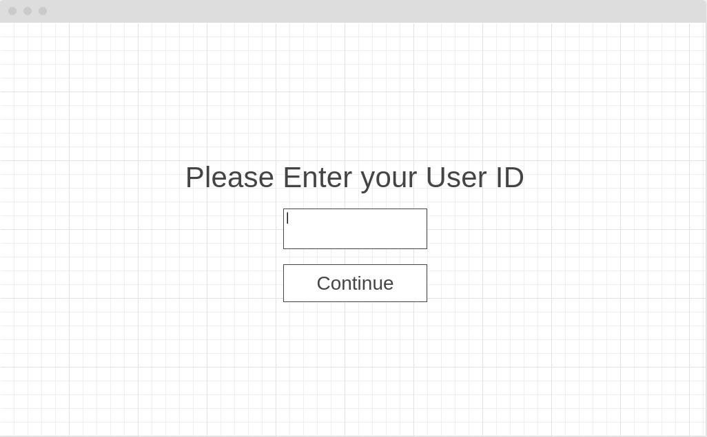
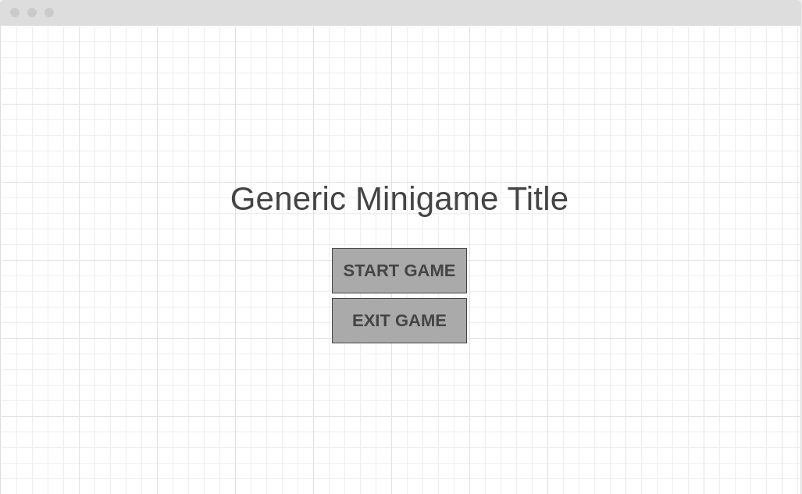
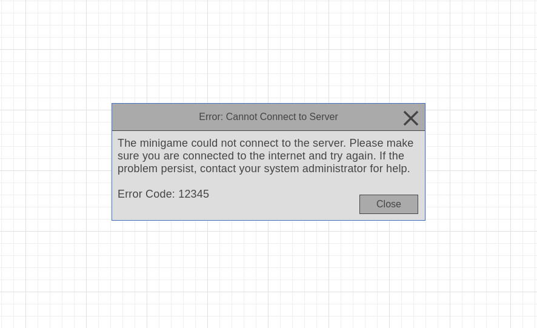

 Get Knocked Down# Software Requirements Specification
## For Mini-game Battery Project

Version 0.1  
Prepared by <author> 
<organization>  
<date created>  

Table of Contents
=================
* [Revision History](#revision-history)
* 1 [Introduction](#1-introduction)
  * 1.1 [Document Purpose](#11-document-purpose)
  * 1.2 [Product Scope](#12-product-scope)
  * 1.3 [Definitions, Acronyms and Abbreviations](#13-definitions-acronyms-and-abbreviations)
  * 1.4 [References](#14-references)
  * 1.5 [Document Overview](#15-document-overview)
  * 1.6 [Work Scope](#16-work-scope)
* 2 [Product Overview](#2-product-overview)
  * 2.1 [Product Perspective](#21-product-perspective)
  * 2.2 [Product Functions](#22-product-functions)
  * 2.3 [Product Constraints](#23-product-constraints)
  * 2.4 [User Characteristics](#24-user-characteristics)
  * 2.5 [Assumptions and Dependencies](#25-assumptions-and-dependencies)
  * 2.6 [Apportioning of Requirements](#26-apportioning-of-requirements)
  * 2.7 [Stakeholders](#27-stakeholders)
* 3 [Requirements](#3-requirements)
  * 3.1 [External Interfaces](#31-external-interfaces)
    * 3.1.1 [User Interfaces](#311-user-interfaces)
    * 3.1.2 [Hardware Interfaces](#312-hardware-interfaces)
    * 3.1.3 [Software Interfaces](#313-software-interfaces)
  * 3.2 [Functional](#32-functional)
  * 3.3 [Quality of Service](#33-quality-of-service)
    * 3.3.1 [Performance](#331-performance)
    * 3.3.2 [Security](#332-security)
    * 3.3.3 [Reliability](#333-reliability)
    * 3.3.4 [Availability](#334-availability)
  * 3.4 [Compliance](#34-compliance)
  * 3.5 [Design and Implementation](#35-design-and-implementation)
    * 3.5.1 [Installation](#351-installation)
    * 3.5.2 [Distribution](#352-distribution)
    * 3.5.3 [Maintainability](#353-maintainability)
    * 3.5.4 [Reusability](#354-reusability)
    * 3.5.5 [Portability](#355-portability)
    * 3.5.6 [Cost](#356-cost)
    * 3.5.7 [Deadline](#357-deadline)
    * 3.5.8 [Proof of Concept](#358-proof-of-concept)
* 4 [Verification](#4-verification)
* 5 [Appendixes](#5-appendixes)

## Revision History
| Name | Date             | Reason For Changes  | Version   |
| ---- | -------          | ------------------- | --------- |
| N/A  | October 19, 2020 | First Version       | 1.0.0     |

## 1. Introduction
This section will provide an overview of the entire document.

### 1.1 Document Purpose
<!-- Describe the purpose of the SRS and its intended audience. -->

The purpose of the SRS is to specify the functional and non-functional requirements of the project. It describe how the software will be developed and lays out the framework that will be followed by our team. The audience of this SRS will be the members of Mactivision, Sasha Soraine and Dr. Jacques Carette.
### 1.2 Product Scope
<!-- Identify the product whose software requirements are specified in this document, including the revision or release number. Explain what the product that is covered by this SRS will do, particularly if this SRS describes only part of the system or a single subsystem. Provide a short description of the software being specified and its purpose, including relevant benefits, objectives, and goals. Relate the software to corporate goals or business strategies. If a separate vision and scope document is available, refer to it rather than duplicating its contents here. -->

The product is a mini-game which is designed To measure a player’s cognitive and motor abilities, The purpose in creating these mini-games is to build profiles of the cognitive and motor abilities of players. These profiles could be used by game designers to make informed decisions surrounding the design of challenges before having to implement them. 

The mini-game will focus on a small amount of the abilities that is determined by Sasha. In order to satisfy its purposes, the game will be able to collect and analyse the player data to build profiles of the cognitive and motor abilities of players. These profiles could be used by game designers to make informed decisions surrounding the design of challenges before having to implement them.

The objective of this project is to provide help in developing minigames to help Sasha’s project in G-ScalE and also provide an opportunity for to team to use and continue to develop the skills they have obtained in throughout their studies. And also gain an experience in game development process and unity development.

(draft)

### 1.3 Definitions, Acronyms and Abbreviations

**Cognitive and Motor Abilities**

There are 46 _Cognitive and Motor Abilities_ which are axiomatic abilities used by a human while playing through challenges in video games. We wish to create minigames which will measure these abilities for a user playing them.

**Minigame**

In this document, _minigame(s)_ refer to the Unity games that will be designed for users to play, in order to test users and transmit the gameplay data to the backend (Measurement Framework).

**Measurement Framework**

Measurement Framework is the backend that will be created for this project, that the minigames will connect to and send gameplay data.

**Database**

Database in this document refers to the relational database that will be managed by the _Measurement Framework_, and will be used to store all gameplay data collected and processed by the _Measurement Framework_

**User Profile**

A user profile is a collection of gameplay data for a given user that has been processed by the Measurement Framework.

**Unity**

Unity is a cross-platform game engine developed by Unity Technologies

**PC (personal computer)**

A PC is a computer that is used by one person at a time in a business, a school, or at home. It is not usually a portable computer. PC is an abbreviation for 'personal computer'

**Steam**

Steam is a video game digital distribution service by Valve

### 1.4 References
<!-- List any other documents or Web addresses to which this SRS refers. These may include user interface style guides, contracts, standards, system requirements specifications, use case documents, or a vision and scope document. Provide enough information so that the reader could access a copy of each reference, including title, author, version number, date, and source or location. -->

https://docs.unity3d.com/ScriptReference/Input.html <!-- TODO(dhospital): link to section 3.1.2 -->
https://developer.mozilla.org/en-US/docs/Web/API/WebSockets_API <!-- TODO(dhospital): link to section 3.1.3 -->

### 1.5 Document Overview
Describe what the rest of the document contains and how it is organized.

### 1.6 Work Scope

## 2. Product Overview
<!-- > This section should describe the general factors that affect the product and its requirements. This section does not state specific requirements. Instead, it provides a background for those requirements, which are defined in detail in Section 3, and makes them easier to understand. -->

This section will give an overview of the entire architecture of the system and its requirements, as well as the general factors that will affect the system. Further information regarding the requirements will be defined in detail in Section 3.

### 2.1 Product Perspective
<!-- Describe the context and origin of the product being specified in this SRS. For example, state whether this product is a follow-on member of a product family, a replacement for certain existing systems, or a new, self-contained product. If the SRS defines a component of a larger system, relate the requirements of the larger system to the functionality of this software and identify interfaces between the two. A simple diagram that shows the major components of the overall system, subsystem interconnections, and external interfaces can be helpful. -->

This system will consist of two parts: a set of minigames, and a backend. Each minigame will communicate with the backend while a user plays the minigame, in order to record information from the game.

Each minigame will be built using the Unity engine and each will be designed to measure a relatively small, specific subset of cognitive and motor abilities. The user input in these minigames will mostly be restricted to keyboard input, as keyboards are widely available to most users, however input abstraction in the Unity engine will be made use of in order to switch between input types for most minigames.

The backend is responsible for collecting and storing the data generated by users playing the minigames. It will run on a server machine either in the cloud or on a local machine. Each minigame will pass the backend data about the game as it is played by the user. This data will include input data (what controller is being used), the result of the minigame, information about the user playing the game, the time spent playing the game, etc.

In order for the backend to store the data, it will be coupled with a database. The database will store information about specific minigames, such as which cognitive and motor abilities that minigame measures, the type of minigame, and other minigame specific minigame information. The database will also include data gathered from instances of the minigames being played, such as the date and time of the gameplay, the input type used, the user that played the minigame, etc.

### 2.2 Product Functions
<!-- Summarize the major functions the product must perform or must let the user perform. Details will be provided in Section 3, so only a high level summary (such as a bullet list) is needed here. Organize the functions to make them understandable to any reader of the SRS. A picture of the major groups of related requirements and how they relate, such as a top level data flow diagram or object class diagram, is often effective. -->

The minigames must perform specific tasks in order to accurately measure the cognitive and motor abilities of the user. These tasks include:

* The user interfacing with the minigame will be able to:
  * Start the minigame
  * Quit/exit the minigame
  * Perform inputs on their controller to play the minigame
* The minigame will display the game to the user, as well as play all sounds to the user
* The minigame will record data about each play through of the game
  * That data will be sent to the backend to be processed
  * This data will NOT be presented to the user
* With some minigames, the user will have more than one controller option; these minigames will recognize and use alternative controllers

Since each minigame is essentially be a medium for the backend to measure and record the cognitive and motor abilities of the user who is playing the minigame, the backend will preform the following tasks:
* Establish connections to current minigames being played
* Receive live data from the minigames before, after, and as they are being played
* Read and write to the database to verify and record incoming minigame data

### 2.3 Product Constraints
<!-- This subsection should provide a general description of any other items that will limit the developer’s options. These may include:  

* Interfaces to users, other applications or hardware.  
* Quality of service constraints.  
* Standards compliance.  
* Constraints around design or implementation. -->

This minigame battery project has some constraints regarding the design of the minigames. All minigames must be build using the Unity engine, and must be designed for play on PC. The minigames must be able to be run on lower end machines, as they will be given to various users to play on their personal machines, many of which may not be built to handle higher-end graphics or games. Furthermore, Some of these users may not have access a mouse, and only have the trackpad on their personal laptop to control their cursor, so most minigames must be designed to only require a keyboard, as the subset of motor abilities to use a trackpad versus a mouse are different, and we can assume that every user playing these minigames will have access to a keyboard.

### 2.4 User Characteristics
<!-- Identify the various user classes that you anticipate will use this product. User classes may be differentiated based on frequency of use, subset of product functions used, technical expertise, security or privilege levels, educational level, or experience. Describe the pertinent characteristics of each user class. Certain requirements may pertain only to certain user classes. Distinguish the most important user classes for this product from those who are less important to satisfy. -->

There are two user classes which will use this product:
* General users, which will play the minigames. This group of users is very broad and can contain users in almost any demographic. These users should have basic computer literacy as they will mostly play minigames on a PC.
* Admin users, which will interface with the backend to gather general user profiles and other minigame data. This group of users will have a higher computer literacy, as they may be interfacing with the backend or database directly, possibly through a terminal. Admin users will be the clients of the project.

### 2.5 Assumptions and Dependencies
<!-- List any assumed factors (as opposed to known facts) that could affect the requirements stated in the SRS. These could include third-party or commercial components that you plan to use, issues around the development or operating environment, or constraints. The project could be affected if these assumptions are incorrect, are not shared, or change. Also identify any dependencies the project has on external factors, such as software components that you intend to reuse from another project, unless they are already documented elsewhere (for example, in the vision and scope document or the project plan). -->

The minigames portion of this project will rely on assets from the Unity asset store to develop the minigames. It is assumed that we the developers will find relevant assets in the Unity asset store that will help us build minigames that fit the requirements described in this document in a more time-efficient manner, as opposed to spending more time creating the assets we require. These assets might include:
* 3D models or 2D sprites
* Audio clips for game sounds effects
* Various prebuilt scripts to control various mechanics in the minigames

We estimate that the time saved when using premade assets like these will be substantial, and will help us develop minigames much more efficiently, so more time can be allocated to the design of the games rather than the programming of them.

<!-- TODO(dhospital): Add more assumptions and dependencies -->

### 2.6 Apportioning of Requirements
<!-- Apportion the software requirements to software elements. For requirements that will require implementation over multiple software elements, or when allocation to a software element is initially undefined, this should be so stated. A cross reference table by function and software element should be used to summarize the apportioning.

Identify requirements that may be delayed until future versions of the system (e.g., blocks and/or increments). -->

### 2.7 Stakeholders

## 3. Requirements
<!-- This section specifies the software product's requirements. Specify all of the software requirements to a level of detail sufficient to enable designers to design a software system to satisfy those requirements, and to enable testers to test that the software system satisfies those requirements. -->

__Product Use Case (PUC) Table (Measurement Framework)__

PUC | PUC Name           | Actor(s)         | Input / Output
----|--------------------|------------------|---------------
1   | Record Input       | Player, System   | Key Input(IN)
2   | Start Timer        | System           | Time(OUT)
3   | End Timer          | System           | Time(OUT)
4   | Input Sequence     | Player, System   | Key Input(IN), Success Boolean(OUT)
5   | Stage of Objective | Player, System   | Key Input(IN), Stage Int(OUT)
6   | Change Controls    | System           | Changed Boolean(OUT)
7   | Output Data        | System           | String(OUT)
8   | Start Objective    | Player, System   | Key Input(IN)
9   | End Objective      | Player, System   | Key Input(IN), Success Boolean(OUT)

__Product Use Case (PUC) Table (Generic Game)__

PUC | PUC Name           | Actor(s)         | Input / Output
----|--------------------|------------------|---------------
10  | Move Player        | Player           | Key Input(IN), Pos Vector3(OUT)
11  | Start Game         | Player           | Key Input(IN)
12  | End Game           | Player           | Key Input(IN)
13  | Move Camera        | Player,System    | Key Input(IN), Pos Vector3(OUT)
14  | Move Object        | System           | Key Input(IN), Pos Vector3(OUT)
15  | Change Scene       | System           | Key Input(IN)
16  | Pause Game         | Player           | Key Input(IN)
17  | Show Score         | Player,System    | Key Input(IN), Score Float(OUT)

__Product Use Case (PUC) Table (Database)__

PUC | PUC Name           | Actor(s)         | Input / Output
----|--------------------|------------------|---------------
18  | Read Data          | System           | Query String(IN), Results String(OUT)
19  | Write Data         | System           | Query String(IN)
20  | Delete Data        | System           | Query String(IN)

__Individual Product Use Cases__

PUC No. 1     | Event: Record Input
--------------|--------------------------------
Trigger       | The player provides input to the game.
Preconditions | The game is started. The player is in control.
Procedure     | 1. Record which input was used. 2. Record input state: up, down or held.
Outcome       | Store each new input type and state.

PUC No. 2     | Event: Start Timer
--------------|--------------------------------
Trigger       | Start of game and start of objective.
Preconditions | The player has started game.
Procedure     | Set start time to current time.
Outcome       | Store start time. 

PUC No. 3     | Event: End Timer
--------------|--------------------------------
Trigger       | End of game and objective completion.
Preconditions | The player has completed objective or exited game.
Procedure     | Set end time to current time.
Outcome       | Store end time. 

PUC No. 4     | Event: Input Sequence
--------------|--------------------------------
Trigger       | Start of objective.
Preconditions | Game is started. Player can send inputs.
Procedure     | Record sequence of player inputs.
Outcome       | Player completed sequence or not.

PUC No. 5     | Event: Stage Of Objective
--------------|--------------------------------
Trigger       | Start of objective.
Preconditions | Player is working on objective.
Procedure     | Get which stage of the objective the player is on.
Outcome       | Store objective and stage of objective. 

PUC No. 6     | Event: Change Controls
--------------|--------------------------------
Trigger       | On objective requirement.
Preconditions | Player is working on objective.
Procedure     | Change current key mapping to new key mapping
Outcome       | Player input will perform a different action than before. For example, changing up to down and vice-versa.

PUC No. 7     | Event: Output Data
--------------|--------------------------------
Trigger       | On game exit.
Preconditions | Player exit's game or game over.
Procedure     | Collected stored data into a variable for output.
Outcome       | Output data to long term storage.

PUC No. 8     | Event: Start Objective
--------------|--------------------------------
Trigger       | On new objective.
Preconditions | Player has control.
Procedure     | 1. Start timers. 2. Record Inputs. 3. Record Input Sequence 4. Record Success Rate 5. Monitor Stage of Objective 
Outcome       | Store data from timers and inputs for specific objective by stage of objective.

PUC No. 9     | Event: End Objective
--------------|--------------------------------
Trigger       | On new objective.
Preconditions | Game over or player successfully completed last objective.
Procedure     | 1. Stop timers. 2. Update Success Rate
Outcome       | Store data from timers and inputs from start of objective to end of objective. Record success rate.

PUC No. 10    | Event: Move Player
--------------|--------------------------------
Trigger       | Player engages movement inputs.
Preconditions | Game is started and player has control.
Procedure     | 1. Get player input type. 2. Get input state. 3. Update player coordinates.
Outcome       | Player moves to new coordinates.

PUC No. 11    | Event: Start Game
--------------|--------------------------------
Trigger       | Player selects start.
Preconditions | Game is at start game screen.
Procedure     | Change scene.
Outcome       | Player leaves start game screen and game begins.

PUC No. 12    | Event: End Game
--------------|--------------------------------
Trigger       | Player quits game or game over.
Preconditions | Game is running.
Procedure     | Exit game or on game over return to start game screen.
Outcome       | Player exits the application. 

PUC No. 13    | Event: Move Camera
--------------|--------------------------------
Trigger       | Player moves camera or camera follows player.
Preconditions | Game is running.
Procedure     | Get player input. Set new camera coordinates.
Outcome       | Camera is moved.

PUC No. 14    | Event: Move Object
--------------|--------------------------------
Trigger       | Game requires object to move or player interacts with object.
Preconditions | Game is running.
Procedure     | Set new object coordinates.
Outcome       | Object is moved.

PUC No. 15    | Event: Change Scene
--------------|--------------------------------
Trigger       | Game requires scene change.
Preconditions | Game is running.
Procedure     | Change current scene to new scene.
Outcome       | Scene is changed.

PUC No. 16    | Event: Pause Game
--------------|--------------------------------
Trigger       | Player hits pause input.
Preconditions | Game is running. Player has control.
Procedure     | Don't update game state. Toggle pause state.
Outcome       | Game is paused.

PUC No. 17    | Event: Show Score
--------------|--------------------------------
Trigger       | On player update.
Preconditions | Game is running. Player has control.
Procedure     | Overlay score on to screen using a user interface. 
Outcome       | Play can see their score while playing game.

PUC No. 18    | Event: Read Data
--------------|--------------------------------
Trigger       | Send read query to database.
Preconditions | Connected to database.
Procedure     | Create read query based on framework model.
Outcome       | Display the results from reading the database.

PUC No. 19    | Event: Write Data
--------------|--------------------------------
Trigger       | Send write query to database.
Preconditions | Connected to database.
Procedure     | Create write query from framework data.
Outcome       | Write framework data to database for long term storage.

PUC No. 20    | Event: Delete Data
--------------|--------------------------------
Trigger       | Send delete query to database.
Preconditions | Connected to database.
Procedure     | Create delete query from based on framework model.
Outcome       | Delete data from database.

### 3.1 External Interfaces
<!-- > This subsection defines all the inputs into and outputs requirements of the software system. Each interface defined may include the following content:
* Name of item
* Source of input or destination of output
* Valid range, accuracy, and/or tolerance
* Units of measure
* Timing
* Relationships to other inputs/outputs
* Screen formats/organization
* Window formats/organization
* Data formats
* Command formats
* End messages -->

#### 3.1.1 User interfaces
<!-- Define the software components for which a user interface is needed. Describe the logical characteristics of each interface between the software product and the users. This may include sample screen images, any GUI standards or product family style guides that are to be followed, screen layout constraints, standard buttons and functions (e.g., help) that will appear on every screen, keyboard shortcuts, error message display standards, and so on. Details of the user interface design should be documented in a separate user interface specification.

Could be further divided into Usability and Convenience requirements. -->

<!-- TODO(dhospital): Add some example images of menu UI and error message UI -->

A user launching any of the minigames in this project should be greeted with a _user ID menu_, followed by a _main menu_ screen. The _user ID menu_ screen will simply contain a text field below a phrase asking the user to enter their _user ID_, with a _Continue_ button below that. This ID is unique to the user and should be given to them prior to them playing the game (More details about this _user ID_ are given in section <sectionNumber> <!-- TODO (dhospital): get the section number this information is in-->). An example of this screen is displayed below:

When a user presses the _Continue_ button, the minigame will establish a connection to the backend, which will confirm that the entered _user ID_ is valid (if not, an error will be displayed). If the _user ID_ is valid, the user will be taken to the _main menu_ screen.

From the _main menu_ screen, users should be able to start the game, and exit the game. The design of this screen should be very simple, with little to no game options, as the minigames are specifically designed to test specific cognitive and motor abilities, so the user should not have an options section on the _main menu_. If there are options for the user, they should be minimal, as to not affect the cognitive and motor abilities being measured. The following on-screen buttons should be included with each minigame, which the user can press using their cursor to navigate through the minigame interface:

Menu Button | Function
---|---
Start Game | Starts the minigame for the user. The user should now be able to play the minigame using their controller
Exit Game | Minigame should exit 

Each minigame will have a unique gameplay user interface and experience, which will be specified in the future when individual minigames are being designed. However, all minigames should share a common _main menu_ interface in terms of design and style. This means all _main menus_ should have similar layouts for any buttons and text displayed in the _main menu_; fonts, text sizes, button and title positions, menu sounds, etc., should be consistent across minigames. An example of a _main menu_ design is displayed below:

Each minigame will display error messages to the user when various problems occur within the minigame itself, or an error occurs in the backend, which might propagate to the user's display. An example of an error message is displayed below:

These error messages should be displayed to the user with a standard style, ie. all error messages should look the same, and should be displayed in the same position in the window, with the same styles and button layouts. Error messages should rarely interrupt gameplay, and if they do, the current game should be paused or stopped, and the data measured from that gameplay experience should be discarded, as an error interrupting gameplay would produce unreliable data.

#### 3.1.2 Hardware interfaces
<!-- Describe the logical and physical characteristics of each interface between the software product and the hardware components of the system. This may include the supported device types, the nature of the data and control interactions between the software and the hardware, and communication protocols to be used. -->

The Measurement framework does not have any hardware interfaces, apart from the physical machine that it is being run on, however that machine will likely only be accessed remotely by admin users who wish to access the Measurement Framework's database.

The minigames will will be controlled by the user's controller (keyboard, keyboard + mouse, game controller, etc.). The minigames will use the _Unity Engine Input System_ <!-- TODO(dhospital): add reference--> respond to keyboard and controller key or button presses, or mouse movements and clicks. This system will abstract away the type of a controller the user is using to play the game so that the minigame code only needs to reference the _action_ the user performs. For example, the _W_ key on the user's keyboard might be used to move the player on screen forward. The _Unity Engine Input System_ will have the _W_ key mapped to the _forward_ action, so the code only needs to listen for the _forward_ action to occur to move the player forward. This allows for other controllers' buttons to be mapped to the same actions, which lets users use different controllers without having to write extra code to allow for those controllers.

#### 3.1.3 Software interfaces
<!-- Describe the connections between this product and other specific software components (name and version), including databases, operating systems, tools, libraries, and integrated commercial components. Identify the data items or messages coming into the system and going out and describe the purpose of each. Describe the services needed and the nature of communications. Refer to documents that describe detailed application programming interface protocols. Identify data that will be shared across software components. If the data sharing mechanism must be implemented in a specific way (for example, use of a global data area in a multitasking operating system), specify this as an implementation constraint. -->

The minigames will communicate with the Measurement Framework via websockets using the _Mozilla Websocket API_ <!-- TODO(dhospital): add reference -->. When a user enters their user ID in the minigame, the minigame will establish a websocket connection with the Measurement Framework, which will be running on a dedicated server machine. The minigame and Measurement Framework will communicate via this websocket connection, which allows the minigame to send all gameplay data to the Measurement Framework, which in turn will process the data and save it to its database. The websocket connection will be closed once the user has finished playing the minigame (ie. returning to the _main menu_)and all relevant data has been recorded and transmitted.

The Management Framework is responsible for reading, writing, and deleting data points from the database. The database we will use for this project will be a SQL relational database. Whenever the Measurement Framework is started up, The database will be created if it does not already exist. The Measurement Framework will read and write to the database while it is processing data received over the websocket from a minigame.

### 3.2 Functional
<!-- This section specifies the requirements of functional effects that the software-to-be is to have on its environment.
 The specific requirements should:
* Be uniquely identifiable.
* State the subject of the requirement (e.g., system, software, etc.) and what shall be done.
* Optionally state the conditions and constraints, if any.
* Describe every input (stimulus) into the software system, every output (response) from the software system, and all functions performed by the software system in response to an input or in support of an output.
* Be verifiable (e.g., the requirement realization can be proven to the customer's satisfaction)
* Conform to agreed upon syntax, keywords, and terms.
-->

ID F-1         | Type: Functional 
---------------|----------------------------------------------------------------
PUC: 1         | Originator: Team
Description    | Record input from player.
Rationale      | In order to measure physical abilities of player, the measurement framework needs to be able to record input and input state.
Constraints    | The project must support multiple controllers so a controller abstraction will be needed.
Priority       | Very High

ID F-2         | Type: Functional 
---------------|----------------------------------------------------------------
PUC: 2,3       | Originator: Team
Description    | Objective Timers and Game Timers. 
Rationale      | Timers are need to measure the cognitive and physical abilities of the player. Measure how fast or slow the player is.
Constraints    | Framework must coordinate timers with each individual game.
Priority       | Very High

ID F-3         | Type: Functional 
---------------|----------------------------------------------------------------
PUC: 4         | Originator: Team
Description    | Request the player complete a sequence of inputs. 
Rationale      | In order to measure the accuracy of the players ability to button mash, alternate inputs and complete input combinations.
Constraints    | Framework must coordinate input sequence with each individual game.
Priority       | Very High

ID F-4         | Type: Functional 
---------------|----------------------------------------------------------------
PUC: 5         | Originator: Team
Description    | How close is the player to completing the objective.
Rationale      | Want to be able to measure how close the player is to completing an objective and record how quickly they complete it and are they improving over time.
Constraints    | Framework must coordinate with game objectives of each individual game.
Priority       | Very High

ID F-4         | Type: Functional 
---------------|----------------------------------------------------------------
PUC: 6         | Originator: Team
Description    | Change player controls during game.
Rationale      | In order to measure the adaptability of the player when controls change or are newly introduced. 
Constraints    | Framework must coordinate with game control scheme of each individual game.
Priority       | Medium

ID F-5         | Type: Functional 
---------------|----------------------------------------------------------------
PUC: 7         | Originator: Team
Description    | Output the measurements collected for each game session.
Rationale      | Required to tune measurement collecting techniques and for overall analyze of player's cognitive and physical abilities.
Constraints    | Output must be organized enough to be human readable.
Priority       | Very High

ID F-6         | Type: Functional 
---------------|----------------------------------------------------------------
PUC: 8,9       | Originator: Team
Description    | Record the start and end of objectives. How long did the player take and how successful was the player? 
Rationale      | Since objectives will vary in type and difficulty this is need to contextualize the measurements collected from the player. 
Constraints    | Framework must coordinate with game objectives of each individual game.
Priority       | Very High

ID F-7         | Type: Functional 
---------------|----------------------------------------------------------------
PUC: 10        | Originator: Team
Description    | All the player to move around the game world. Allow the game to move the player. 
Rationale      | Many game types require players are able to move around in the game world.
Constraints    | Make sure player doesn't go out of bounds.
Priority       | Very High

ID F-8         | Type: Functional 
---------------|----------------------------------------------------------------
PUC: 11,12     | Originator: Team
Description    | Start and end game.
Rationale      | Having specific start and end game states provides windows of measurement. Also, lets the player know when the game has started and ended.
Constraints    | Must have start and end game scenes.
Priority       | High

ID F-9         | Type: Functional 
---------------|----------------------------------------------------------------
PUC: 13        | Originator: Team
Description    | Move the camera around the game world.
Rationale      | Many game types require camera to move around. However, mini games often use a fixed camera.
Constraints    | Make sure camera doesn't go out of bounds.
Priority       | Low

ID F-10        | Type: Functional 
---------------|----------------------------------------------------------------
PUC: 14        | Originator: Team
Description    | Move the object around the game world.
Rationale      | Most game types require non player objects to move around the game world.
Constraints    | Make sure objects doesn't go out of bounds and are properly created and destroyed to not waste memory.
Priority       | Very High

ID F-11        | Type: Functional 
---------------|----------------------------------------------------------------
PUC: 15        | Originator: Team
Description    | Be able to change game scene.
Rationale      | Need to be able to change between start scene, game scene, end game scene, settings scene and pause scene.
Constraints    | Keep scenes to a minimum to avoid over complicated game.
Priority       | Very High

ID F-12        | Type: Functional 
---------------|----------------------------------------------------------------
PUC: 16        | Originator: Team
Description    | Player has ability to pause game.
Rationale      | Give the player a break if they need it.
Constraints    | Make sure to pause game state and timers.
Priority       | Very High

ID F-13        | Type: Functional 
---------------|----------------------------------------------------------------
PUC: 17        | Originator: Team
Description    | Show player score (how well they are completing objectives) during game play.
Rationale      | Provides feedback to the player on how well they are doing. This can allow them to make changes in their game play to improve their performance.
Constraints    | Only show during game play and game over / end scene.
Priority       | Medium

ID F-13        | Type: Functional 
---------------|----------------------------------------------------------------
PUC: 17        | Originator: Team
Description    | Read measurement data from database.
Rationale      | Measurement data will need to be reviewed for player analyze after the games are completed.
Constraints    | Requires data models be created.
Priority       | Low

ID F-13        | Type: Functional 
---------------|----------------------------------------------------------------
PUC: 18        | Originator: Team
Description    | Write measurement data from database.
Rationale      | Write player measurement data for one player over multiple games. Useful for tuning measurements between two separate games. 
Constraints    | Requires data models be created and the ability for each game to write data.
Priority       | High

ID F-14        | Type: Functional 
---------------|----------------------------------------------------------------
PUC: 19        | Originator: Team
Description    | Delete measurement data from database.
Rationale      | Makes organizing data easier.
Constraints    | Make sure data is safe to delete.
Priority       | Low

### 3.3 Quality of Service
<!-- > This section states additional, quality-related property requirements that the functional effects of the software should present. -->

ID Q-1         | Type: Non-Functional (Quality)
---------------|----------------------------------------------------------------
PUC: N\A       | Originator: Team
Description    | Games are made with a playful and aesthetically pleasing interface.
Rationale      | Makes the player treat the game more as a game than a test which increases the accuracy of measurements.
Constraints    | Difficulty to find high quality free assets
Priority       | High

#### 3.3.1 Performance
<!-- If there are performance requirements for the product under various circumstances, state them here and explain their rationale, to help the developers understand the intent and make suitable design choices. Specify the timing relationships for real time systems. Make such requirements as specific as possible. You may need to state performance requirements for individual functional requirements or features. -->

ID P-1         | Type: Non-Functional (Performance)
---------------|----------------------------------------------------------------
PUC: N\A       | Originator: Team
Description    | Minimum FPS of 60 at 1080p
Rationale      | Unstable frame rates or frame rates below 60 negatively effect player performance. Measurements will be inaccurate.
Constraints    | Amount of graphical effects on screen.
Priority       | High

ID P-2         | Type: Non-Functional (Performance)
---------------|----------------------------------------------------------------
PUC: N\A       | Originator: Team
Description    | Player input is low latency.
Rationale      | Latency negatively effect player performance. Measurements will be inaccurate.
Constraints    | Cannot improve latency if player's hardware / software is at fault.
Priority       | Low

#### 3.3.2 Security
<!-- Specify any requirements regarding security or privacy issues surrounding use of the product or protection of the data used or created by the product. Define any user identity authentication requirements. Refer to any external policies or regulations containing security issues that affect the product. Define any security or privacy certifications that must be satisfied. -->

ID S-1         | Type: Non-Functional (Security)
---------------|----------------------------------------------------------------
PUC: N\A       | Originator: Team
Description    | Measurement data will tied to specific game or series of games and not to a specific person.
Rationale      | Lowers complexity project. An invigilator of the game testing can record personal information that would help measure player ability.
Constraints    | If games are played online through Unity, Unity will have it's own privacy policy. 
Priority       | Low

#### 3.3.3 Reliability

ID R-1         | Type: Non-Functional (Reliability)
---------------|----------------------------------------------------------------
PUC: N\A       | Originator: Team
Description    | Player measurements must be reliable
Rationale      | If measurements aren't reliable the player analyze will be inaccurate. 
Constraints    | Maintaining reliability over multiple games.
Priority       | High

#### 3.3.4 Availability
<!-- Specify the factors required to guarantee a defined availability level for the entire system such as checkpoint, recovery, and restart. -->

ID A-1         | Type: Non-Functional (Availability)
---------------|----------------------------------------------------------------
PUC: 18,19,20  | Originator: Team
Description    | Make sure database connection is established during game.
Rationale      | Database needs to be available in order to write measurement data.
Constraints    | Number of database connections if multiple games are being tested.
Priority       | High

### 3.4 Compliance
<!-- Specify the requirements derived from existing standards or regulations, including:  
* Report format
* Data naming
* Accounting procedures
* Audit tracing

For example, this could specify the requirement for software to trace processing activity. Such traces are needed for some applications to meet minimum regulatory or financial standards. An audit trace requirement may, for example, state that all changes to a payroll database shall be recorded in a trace file with before and after values.
-->

ID: C-1        | Type: Non-functional Requirements (Compliance)
---------------|----------------------------------------------------------------
PUC: N/A       | Originator: Team
Description    | Project will adhere to Unity terms and conditions.
Rationale      | Required for legal use of software.
Fit Criterion  | All terms and conditions will be followed.
Priority       | Very High

ID: C-2        | Type: Non-functional Requirements (Compliance)
---------------|----------------------------------------------------------------
PUC: N/A       | Originator: Team
Description    | Project will adhere to McMaster's Academic Integrity policy.
Rationale      | Required to be a student of McMaster University.
Fit Criterion  | All terms and conditions will be followed.
Priority       | Very High

ID: C-3        | Type: Non-functional Requirements (Compliance)
---------------|----------------------------------------------------------------
PUC: N/A       | Originator: Team
Description    | Project will licensed under Creative Commons Attribution 3.0 License.
Rationale      | Required for legal use of software and assets.
Fit Criterion  | All terms and conditions will be followed.
Priority       | Very High

### 3.5 Design and Implementation

#### 3.5.1 Installation
<!-- Constraints to ensure that the software-to-be will run smoothly on the target implementation platform. -->
If third-party app stores are used, such as steam, they will handle installation. Otherwise, Inno Setup can be used to create an installer for the project. In either case, the user will not have to worry about where to put files or how to remove them. Furthermore, the Installations will run smoothly because the Unity runtime is self-contained and does not require redistributables like the Visual C++ runtime library or auxiliary third party applications.

#### 3.5.2 Distribution
<!-- Constraints on software components to fit the geographically distributed structure of the host organization, the distribution of data to be processed, or the distribution of devices to be controlled. -->

Unity Distribution Portal allows game developers to distribute games to multiple app stores through a single hub. Projects can also be distributed manually by supplying users with copies of production builds.  WebGL builds can be played online through a modern browser. Other builds require a download onto the user’s hardware. The size of download will depend on the size of the code base and assets. Distribution to those without internet connections would be more difficult. However, physical media, such as spinning discs, could be used to reach those without connections.
This project does not provide any hardware or controller devices, they must be supplied by the user.

#### 3.5.3 Maintainability
<!-- Specify attributes of software that relate to the ease of maintenance of the software itself. These may include requirements for certain modularity, interfaces, or complexity limitation. Requirements should not be placed here just because they are thought to be good design practices. -->

Unity games are written in C# which is strongly typed to prevent common programming errors. C# is object oriented, which provides modularity.  The .NET standard library reduces complexity and increases maintainability. Debugging C# code can be done with Visual Studio. 

#### 3.5.4 Reusability
<!-- TODO: come up with a description -->

Game logic and player cognitive and physical analysis could be reusable in other projects. Code, which interfaces with Unity, would only be reusable with other Unity projects.

#### 3.5.5 Portability
<!-- Specify attributes of software that relate to the ease of porting the software to other host machines and/or operating systems. -->

Unity provides multi-platform support for personal computers, phones, websites and consoles. Unity also supports multiple input devices such as, keyboard, mouse, touch, joystick and game pads. C# code is portable to Windows, Mac and Linux.

#### 3.5.6 Cost
<!-- Specify monetary cost of the software product. -->
Unity is free as long as “revenue or funding is less than $100K in the last 12 months”. Editors for coding with Unity such as Visual Studio and Visual Studio Code have free community versions. Github provides free public repos. Some assets are available in the Unity Store for free. Other free assets may be found online.

#### 3.5.7 Deadline
<!-- Specify schedule for delivery of the software product. -->
Week   | Deliverables
-------|----------------------
Oct 19 | Requirements Specification
Oct 28 | Prototype
Nov 13 | Design
Jan 11 | Prototype 2.0
Feb 4  | Internal and External Testing
Mar 11 | Final Version
Mar 18 | Internal Demo
Mar 25 | Extra Time
Apr 5  | Capstone Day Materials
Apr 8  | Capstone Day Showcase

#### 3.5.8 Proof of Concept
<!-- TODO: come up with a description -->

## 4. Verification
<!-- > This section provides the verification approaches and methods planned to qualify the software. The information items for verification are recommended to be given in a parallel manner with the requirement items in Section 3. The purpose of the verification process is to provide objective evidence that a system or system element fulfills its specified requirements and characteristics. -->

In order to ensure the set of requirements is correct and complete, we should set 2 groups of inspectors which is external and internal inspectors. For external inspectors, we can set up a gamer role which is responsible for checking the functional requirements for adequacy and completeness from the perspective of a gamer. For internal inspectors, we need quality assurance role to be responsible for the idea of game can meet the specification of project. At last, there will be a implementation inspector for determining the feasibility of implementing the systems and reviewing the non-functional requirements of the system so that they can accurately access the feasibility of implementing a system that satisfies all non-functional requirements.

<!-- TODO: give more guidance, similar to section 3 -->
<!-- ieee 15288:2015 -->

## 5. Appendixes

